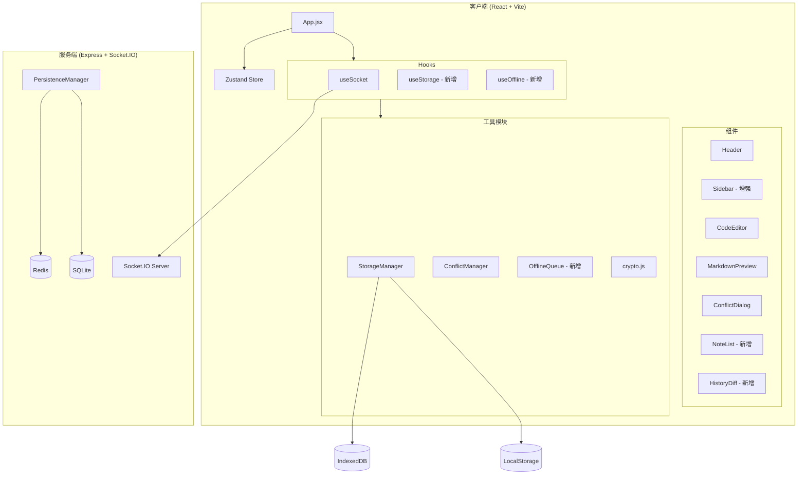
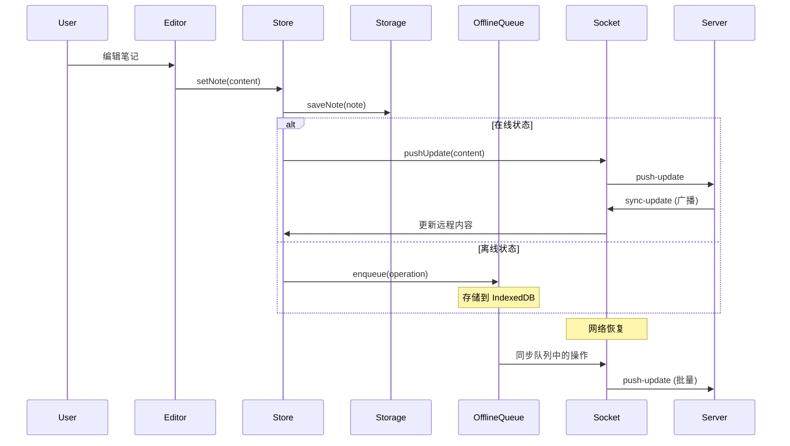

# 笔记同步系统全面重构设计文档

## 概述

本设计文档描述了对现有笔记同步系统的全面重构方案。重构的核心目标是将已实现但未集成的功能模块（存储系统、冲突管理、离线队列）整合到主应用中，并添加多笔记支持和历史版本增强功能。

## 架构

### 系统架构图



### 数据流架构



## 组件和接口

### 1. 存储系统集成

#### useStorage Hook (新增)

```javascript
// brave-sync-notes/client/src/hooks/useStorage.js

/**
 * 存储管理 Hook
 * 提供统一的存储接口，自动处理 IndexedDB/LocalStorage 切换
 */
export const useStorage = () => {
  const [isInitialized, setIsInitialized] = useState(false);
  const [storageType, setStorageType] = useState(null);
  const [error, setError] = useState(null);
  const storageRef = useRef(null);

  // 初始化存储
  const initialize = async () => { /* ... */ };
  
  // 保存笔记
  const saveNote = async (notebookId, note) => { /* ... */ };
  
  // 获取笔记
  const getNote = async (notebookId, noteId) => { /* ... */ };
  
  // 获取所有笔记
  const getAllNotes = async (notebookId) => { /* ... */ };
  
  // 删除笔记
  const deleteNote = async (notebookId, noteId) => { /* ... */ };
  
  // 保存历史
  const saveHistory = async (notebookId, noteId, entry) => { /* ... */ };
  
  // 获取历史
  const getHistory = async (notebookId, noteId) => { /* ... */ };
  
  // 清理存储
  const cleanup = async () => { /* ... */ };

  return {
    isInitialized,
    storageType,
    error,
    initialize,
    saveNote,
    getNote,
    getAllNotes,
    deleteNote,
    saveHistory,
    getHistory,
    cleanup,
  };
};
```

### 2. 离线队列系统

#### OfflineQueue 类 (新增)

```javascript
// brave-sync-notes/client/src/utils/offline/OfflineQueue.js

/**
 * 离线操作队列
 * 管理离线时的编辑操作，网络恢复后自动同步
 */
class OfflineQueue {
  constructor(storage) {
    this.storage = storage;
    this.queue = [];
    this.isProcessing = false;
  }

  // 添加操作到队列
  async enqueue(operation) { /* ... */ }
  
  // 处理队列中的操作
  async processQueue(socket) { /* ... */ }
  
  // 获取队列大小
  getQueueSize() { /* ... */ }
  
  // 清空队列
  async clearQueue() { /* ... */ }
  
  // 获取队列状态
  getStatus() { /* ... */ }
}
```

#### useOffline Hook (新增)

```javascript
// brave-sync-notes/client/src/hooks/useOffline.js

/**
 * 离线状态管理 Hook
 * 监控网络状态，管理离线队列
 */
export const useOffline = () => {
  const [isOnline, setIsOnline] = useState(navigator.onLine);
  const [queueSize, setQueueSize] = useState(0);
  const queueRef = useRef(null);

  // 添加操作到离线队列
  const enqueueOperation = async (operation) => { /* ... */ };
  
  // 处理离线队列
  const processQueue = async (socket) => { /* ... */ };
  
  // 获取离线状态
  const getOfflineStatus = () => { /* ... */ };

  return {
    isOnline,
    queueSize,
    enqueueOperation,
    processQueue,
    getOfflineStatus,
  };
};
```

### 3. 多笔记支持

#### Note 数据模型

```javascript
/**
 * 笔记数据结构
 */
interface Note {
  id: string;           // 唯一标识符
  title: string;        // 笔记标题
  content: string;      // 笔记内容
  createdAt: number;    // 创建时间戳
  updatedAt: number;    // 更新时间戳
  version: number;      // 版本号
  tags: string[];       // 标签列表
  deviceId: string;     // 最后编辑设备
}
```

#### NoteList 组件 (新增)

```javascript
// brave-sync-notes/client/src/components/NoteList/NoteList.jsx

/**
 * 笔记列表组件
 * 显示和管理多个笔记
 */
const NoteList = ({
  notes,
  activeNoteId,
  onSelectNote,
  onCreateNote,
  onDeleteNote,
  onRenameNote,
  searchQuery,
  darkMode,
}) => {
  // 过滤和排序笔记
  const filteredNotes = useMemo(() => {
    return notes
      .filter(note => 
        note.title.toLowerCase().includes(searchQuery.toLowerCase()) ||
        note.content.toLowerCase().includes(searchQuery.toLowerCase())
      )
      .sort((a, b) => b.updatedAt - a.updatedAt);
  }, [notes, searchQuery]);

  return (
    <div className="note-list">
      {/* 搜索框 */}
      {/* 新建按钮 */}
      {/* 笔记列表 */}
    </div>
  );
};
```

### 4. 历史版本增强

#### HistoryDiff 组件 (新增)

```javascript
// brave-sync-notes/client/src/components/History/HistoryDiff.jsx

/**
 * 历史版本差异对比组件
 * 显示两个版本之间的差异
 */
const HistoryDiff = ({
  oldVersion,
  newVersion,
  onRestore,
  onClose,
  darkMode,
}) => {
  // 计算差异
  const diff = useMemo(() => {
    return computeDiff(oldVersion.content, newVersion.content);
  }, [oldVersion, newVersion]);

  return (
    <div className="history-diff">
      {/* 版本信息 */}
      {/* 差异视图 */}
      {/* 操作按钮 */}
    </div>
  );
};
```

### 5. Store 增强

```javascript
// brave-sync-notes/client/src/store/useStore.js (增强)

export const useAppStore = create(
  persist(
    (set, get) => ({
      // 现有状态...
      
      // 多笔记状态 (新增)
      notes: [],                    // 笔记列表
      activeNoteId: null,           // 当前活动笔记ID
      
      // 离线状态 (新增)
      isOnline: true,               // 网络状态
      offlineQueueSize: 0,          // 离线队列大小
      
      // 存储状态 (新增)
      storageInitialized: false,    // 存储是否初始化
      storageType: null,            // 当前存储类型
      
      // 多笔记操作 (新增)
      setNotes: (notes) => set({ notes }),
      addNote: (note) => set((state) => ({ 
        notes: [...state.notes, note] 
      })),
      updateNote: (noteId, updates) => set((state) => ({
        notes: state.notes.map(n => 
          n.id === noteId ? { ...n, ...updates } : n
        )
      })),
      removeNote: (noteId) => set((state) => ({
        notes: state.notes.filter(n => n.id !== noteId)
      })),
      setActiveNoteId: (noteId) => set({ activeNoteId: noteId }),
      
      // 离线操作 (新增)
      setIsOnline: (isOnline) => set({ isOnline }),
      setOfflineQueueSize: (size) => set({ offlineQueueSize: size }),
      
      // 存储操作 (新增)
      setStorageInitialized: (initialized) => set({ storageInitialized: initialized }),
      setStorageType: (type) => set({ storageType: type }),
    }),
    {
      name: 'note-sync-storage',
      partialize: (state) => ({
        // 现有持久化字段...
        notes: state.notes,
        activeNoteId: state.activeNoteId,
      }),
    }
  )
);
```

## 数据模型

### 存储 Schema

```javascript
// IndexedDB Schema
const DB_SCHEMA = {
  name: 'NoteSyncDB',
  version: 2,
  stores: {
    notes: {
      keyPath: 'id',
      indexes: [
        { name: 'notebookId', keyPath: 'notebookId' },
        { name: 'updatedAt', keyPath: 'updatedAt' },
        { name: 'title', keyPath: 'title' },
      ]
    },
    history: {
      keyPath: 'id',
      indexes: [
        { name: 'noteId', keyPath: 'noteId' },
        { name: 'timestamp', keyPath: 'timestamp' },
      ]
    },
    pendingOps: {
      keyPath: 'id',
      indexes: [
        { name: 'timestamp', keyPath: 'timestamp' },
        { name: 'type', keyPath: 'type' },
      ]
    },
    settings: {
      keyPath: 'key',
    }
  }
};
```

### 离线操作数据结构

```javascript
/**
 * 离线操作数据结构
 */
interface PendingOperation {
  id: string;           // 操作ID
  type: 'create' | 'update' | 'delete';  // 操作类型
  noteId: string;       // 笔记ID
  data: any;            // 操作数据
  timestamp: number;    // 操作时间戳
  retryCount: number;   // 重试次数
}
```

## 正确性属性

*正确性属性是系统应该在所有有效执行中保持为真的特征或行为。属性作为人类可读规范和机器可验证正确性保证之间的桥梁。*

### Property 1: 存储往返一致性

*For any* valid note object, saving it to storage and then retrieving it should produce an equivalent object with the same content, title, and metadata.

**Validates: Requirements 1.3, 1.4**

### Property 2: 存储降级数据保持

*For any* data stored in IndexedDB, when IndexedDB becomes unavailable and the system falls back to LocalStorage, the data should remain accessible and unchanged.

**Validates: Requirements 1.2**

### Property 3: 冲突检测完整性

*For any* two edits to the same note with timestamps within 5 seconds of each other, the ConflictManager should detect a conflict and preserve both versions.

**Validates: Requirements 2.1**

### Property 4: 三路合并正确性

*For any* base version and two divergent edits, the three-way merge should produce a result that contains all non-conflicting changes from both versions.

**Validates: Requirements 2.4**

### Property 5: 离线队列顺序保持

*For any* sequence of offline operations, when processed after reconnection, the operations should be applied in the same order they were enqueued.

**Validates: Requirements 3.2, 3.3**

### Property 6: 笔记唯一标识符

*For any* number of notes created, each note should have a unique identifier that does not collide with any other note's identifier.

**Validates: Requirements 4.1**

### Property 7: 笔记切换数据保持

*For any* note switch operation, the previously active note's content should be saved before loading the new note, and switching back should restore the exact content.

**Validates: Requirements 4.2**

### Property 8: 笔记排序正确性

*For any* list of notes, the displayed order should always be sorted by updatedAt timestamp in descending order (most recent first).

**Validates: Requirements 4.5**

### Property 9: 历史版本限制

*For any* note with history entries, when the history count exceeds 50, the oldest entries should be automatically removed to maintain exactly 50 entries.

**Validates: Requirements 5.5**

### Property 10: 版本恢复完整性

*For any* history entry restoration, the current note content should be updated to match the restored version exactly, and a new history entry should be created.

**Validates: Requirements 5.4**

### Property 11: 版本号递增正确性

*For any* note save operation, the version number should be incremented by exactly 1 from the previous version.

**Validates: Requirements 7.2**

### Property 12: 数据验证拒绝无效输入

*For any* note object missing required fields (id, content), the storage system should reject the save operation and throw an appropriate error.

**Validates: Requirements 7.4**

## 错误处理

### 存储错误

| 错误类型 | 处理方式 |
|---------|---------|
| IndexedDB 不可用 | 自动降级到 LocalStorage，显示提示 |
| 存储配额超限 | 显示警告，提供清理选项 |
| 数据损坏 | 尝试从备份恢复，显示错误信息 |
| 写入失败 | 重试 3 次，失败后显示错误 |

### 网络错误

| 错误类型 | 处理方式 |
|---------|---------|
| 连接断开 | 切换到离线模式，显示离线指示器 |
| 同步失败 | 将操作加入离线队列，稍后重试 |
| 重连失败 | 显示重连状态，最多重试 10 次 |
| 服务器错误 | 显示错误信息，保持本地数据 |

### 冲突错误

| 错误类型 | 处理方式 |
|---------|---------|
| 检测到冲突 | 显示冲突对话框，等待用户解决 |
| 合并失败 | 保留两个版本，让用户手动选择 |
| 解决失败 | 显示错误，允许重试 |

## 测试策略

### 单元测试

单元测试用于验证具体示例和边界情况：

1. **存储系统测试**
   - 测试 IndexedDB 初始化
   - 测试 LocalStorage 降级
   - 测试数据 CRUD 操作
   - 测试存储配额处理

2. **冲突管理测试**
   - 测试冲突检测逻辑
   - 测试各种解决策略
   - 测试三路合并算法

3. **离线队列测试**
   - 测试操作入队
   - 测试队列处理
   - 测试重连同步

4. **多笔记测试**
   - 测试笔记创建
   - 测试笔记切换
   - 测试笔记删除
   - 测试搜索过滤

### 属性测试

属性测试用于验证跨所有输入的通用属性。每个属性测试应运行至少 100 次迭代。

使用 **fast-check** 库进行属性测试。

每个测试必须使用以下格式标注：
**Feature: comprehensive-refactor, Property {number}: {property_text}**

### 测试修复计划

需要修复的现有测试：

1. **版本号递增测试** - 修复 `saveNote` 方法以正确读取和递增版本号
2. **笔记排序测试** - 调整测试以使用实际保存时间戳
3. **历史清理测试** - 修复 `cleanupHistory` 返回值逻辑
4. **数据清理测试** - 修复 `cleanup` 方法的计数逻辑
5. **数据验证测试** - 加强 `saveNote` 的输入验证

