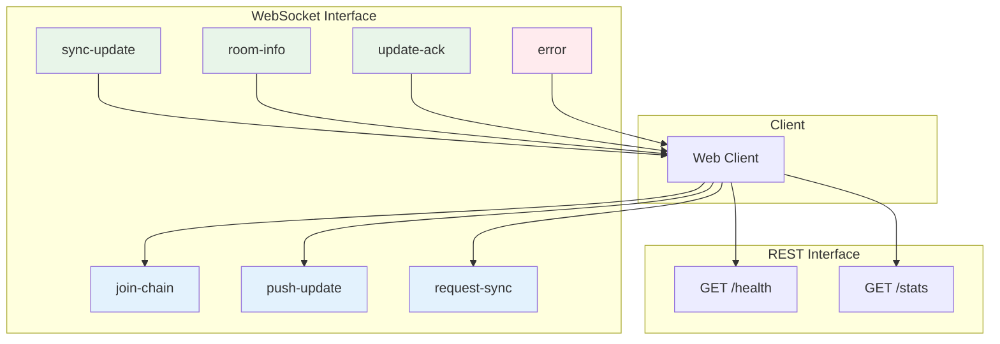
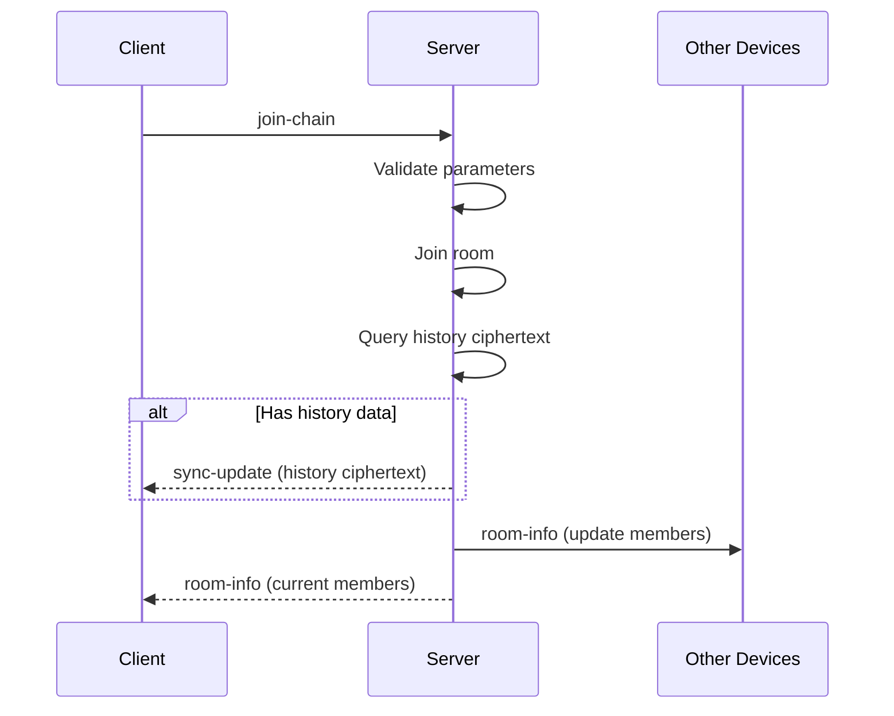
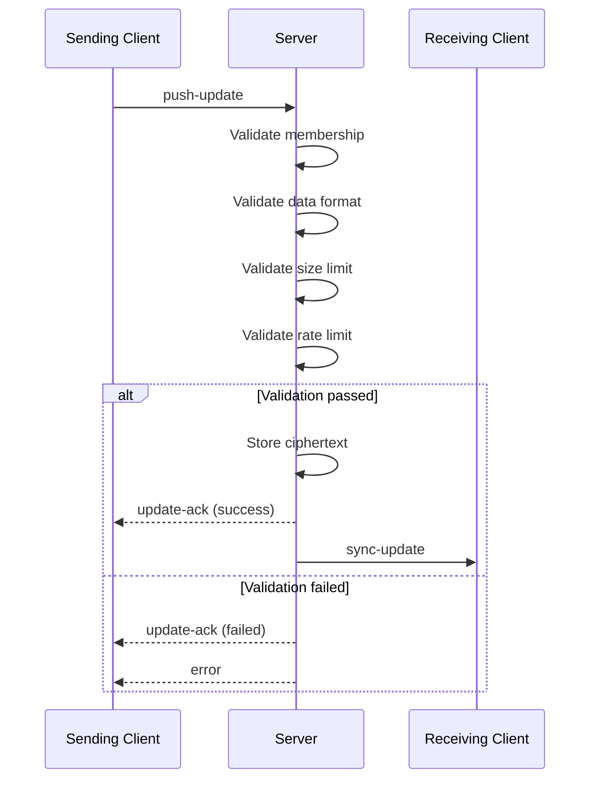
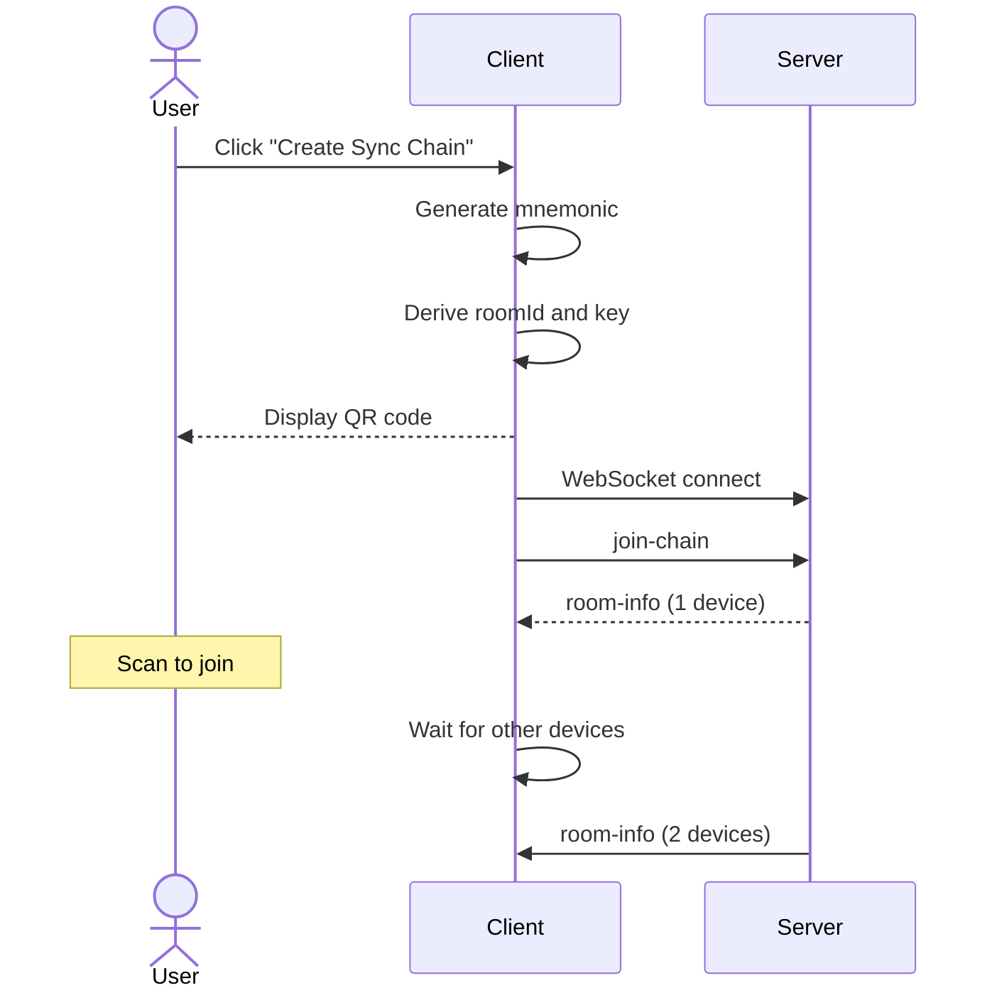
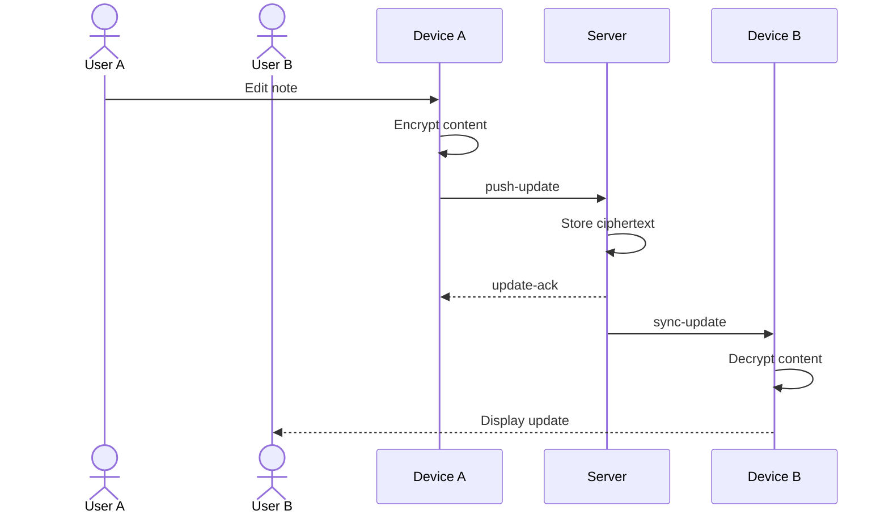
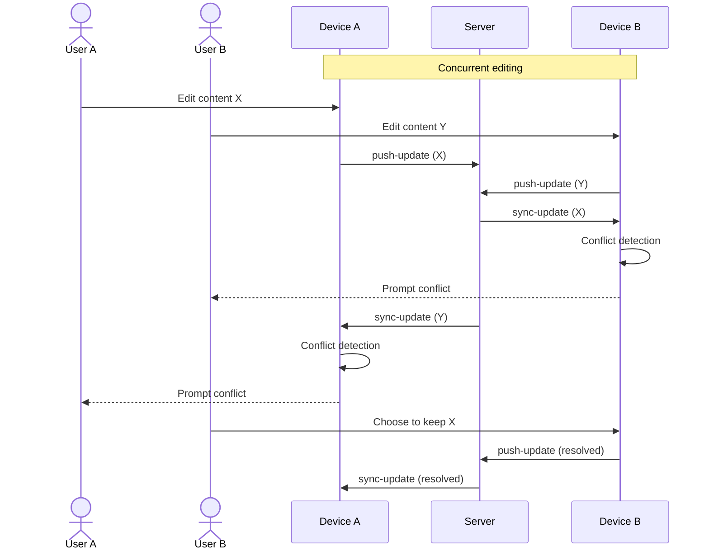
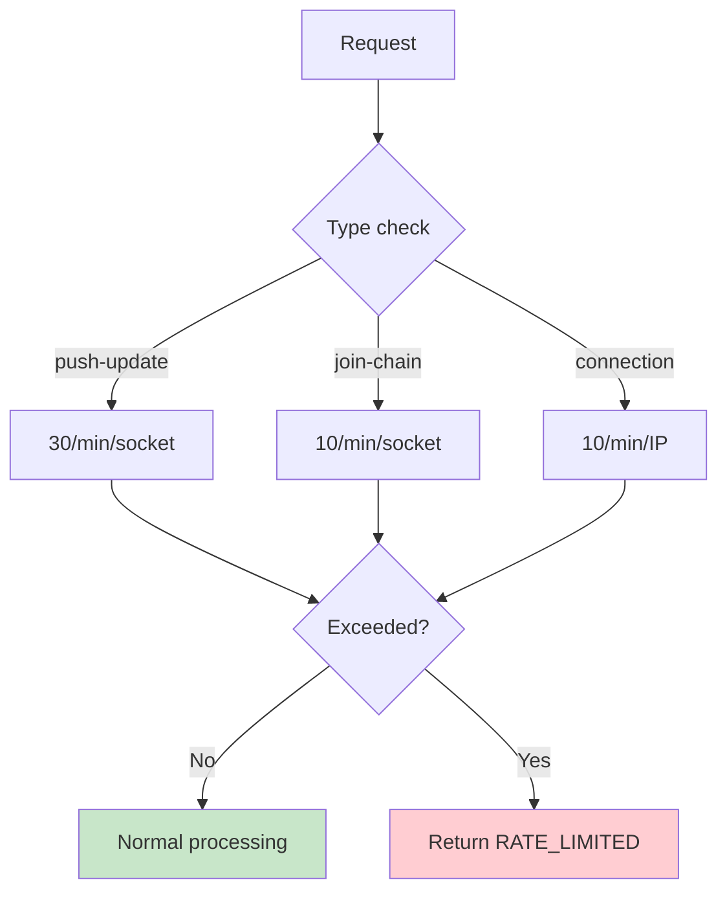

# API Design

This document defines the complete API interface specifications for Note Sync Now.

## Interface Overview



## WebSocket Interface

### Connection

```
ws://<host>:<port>/
```

**Connection Parameters**:

| Parameter | Default | Description |
|-----------|---------|-------------|
| `transports` | `['websocket']` | WebSocket only |
| `reconnection` | `true` | Auto reconnect |
| `reconnectionDelay` | `1000ms` | Reconnect delay |
| `reconnectionAttempts` | `Infinity` | Infinite retry |

### join-chain

Join a sync chain (room).

```typescript
// Client sends
socket.emit('join-chain', {
  roomId: string,      // Room ID, 32-character hexadecimal
  deviceName: string   // Device name, 1-50 characters
})

// Server responds
// 1. If room has history data
socket.emit('sync-update', {
  encryptedData: string,  // Base64-encoded ciphertext
  fromDevice: 'server',   // Source identifier
  timestamp: number       // Timestamp
})

// 2. Broadcast room info
socket.emit('room-info', {
  roomId: string,
  devices: string[],      // Current device list
  memberCount: number     // Member count
})
```

**Validation Rules**:

| Field | Rule | Error Code |
|-------|------|------------|
| roomId | 32-character hexadecimal | `INVALID_ROOM_ID` |
| deviceName | 1-50 characters | `INVALID_DEVICE_NAME` |

**Sequence Diagram**:



### push-update

Push encrypted update to room.

```typescript
// Client sends
socket.emit('push-update', {
  roomId: string,              // Room ID
  encryptedData: string,       // Base64-encoded ciphertext
  chunkIndex?: number,         // Chunk index (chunked mode)
  totalChunks?: number,        // Total chunks (chunked mode)
  sessionId?: string           // Chunk session ID
})

// Server acknowledges
socket.emit('update-ack', {
  success: boolean,
  timestamp: number,
  error?: string               // Failure reason
})

// Broadcast to other members
socket.emit('sync-update', {
  encryptedData: string,
  fromDevice: string,
  timestamp: number
})
```

**Validation Rules**:

| Field | Rule | Error Code |
|-------|------|------------|
| roomId | Joined room | `NOT_IN_ROOM` |
| encryptedData | Non-empty string | `INVALID_DATA` |
| Data size | < 5 MB | `DATA_TOO_LARGE` |
| Rate | 30/min | `RATE_LIMITED` |

**Sequence Diagram**:



### request-sync

Actively request latest sync data.

```typescript
// Client sends
socket.emit('request-sync', {
  roomId: string
})

// Server responds
socket.emit('sync-update', {
  encryptedData: string,
  fromDevice: 'server',
  timestamp: number
})
```

**Use Cases**:

- Recovery after disconnection
- Check for updates when switching to foreground
- Manual refresh

### sync-update

Receive sync update (server push).

```typescript
// Server pushes
socket.on('sync-update', (data: {
  encryptedData: string,   // Base64-encoded ciphertext
  fromDevice: string,      // Source device
  timestamp: number        // Timestamp
}) => {
  // 1. Decrypt content
  // 2. Conflict detection
  // 3. Update local state
})
```

### room-info

Room member information update.

```typescript
// Server pushes
socket.on('room-info', (data: {
  roomId: string,
  devices: Array<{
    name: string,
    joinedAt: number
  }>,
  memberCount: number
}) => {
  // Update UI display
})
```

### update-ack

Server acknowledges update received.

```typescript
// Server responds
socket.on('update-ack', (data: {
  success: boolean,
  timestamp: number,
  error?: string
}) => {
  if (data.success) {
    // Update lastSyncedHash
  } else {
    // Handle error
  }
})
```

### error

Server error notification.

```typescript
// Server pushes
socket.on('error', (data: {
  code: string,
  message: string,
  details?: any
}) => {
  // Handle error
})
```

**Error Codes**:

| Error Code | Description | Client Handling |
|------------|-------------|-----------------|
| `INVALID_ROOM_ID` | Room ID format error | Check input |
| `INVALID_DEVICE_NAME` | Device name format error | Check input |
| `INVALID_DATA` | Data format error | Check encryption flow |
| `NOT_IN_ROOM` | Not joined room | Re-join-chain |
| `DATA_TOO_LARGE` | Data exceeds 5MB | Enable chunking |
| `RATE_LIMITED` | Rate limit exceeded | Backoff retry |
| `ROOM_FULL` | Room full | Wait or change room |
| `INTERNAL_ERROR` | Server internal error | Retry |

## REST Interface

### GET /health

Health check endpoint.

```typescript
// Request
GET /health

// Response 200
{
  "status": "ok",
  "connections": number,      // Current connection count
  "rooms": number,            // Room count
  "persistence": {
    "type": "redis" | "sqlite" | "memory",
    "connected": boolean
  },
  "uptime": number            // Uptime (seconds)
}
```

**Uses**:
- Container health check
- Load balancer probe
- Monitoring alerts

### GET /stats

Statistics endpoint.

```typescript
// Request
GET /stats

// Response 200
{
  "connections": number,        // Current connection count
  "rooms": number,              // Active room count
  "memory": {
    "heapUsed": number,         // Heap used (bytes)
    "heapTotal": number,        // Heap total (bytes)
    "rss": number               // RSS (bytes)
  },
  "persistence": {
    "type": string,             // Storage type
    "connected": boolean,       // Connection status
    "keys": number              // Stored key count
  }
}
```

**Uses**:
- Operations monitoring
- Capacity planning
- Troubleshooting

## Complete Interaction Flows

### Create New Sync Chain



### Real-time Sync



### Conflict Resolution



## Rate Limiting Details



## Implementation Reference

### Key Files

| File | Function |
|------|----------|
| `apps/api/index.js` | Server entry, event handling |
| `apps/web/src/hooks/useSocket.js` | Client sync engine |
| `apps/api/src/persistence/PersistenceManager.js` | Persistence management |
| `apps/api/src/persistence/PersistenceAdapter.js` | Storage adapter |

---

::: tip API Version
Current API version is v1. Future versions will follow semantic versioning, ensuring backward compatibility.
:::
