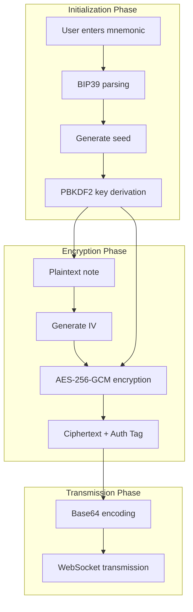
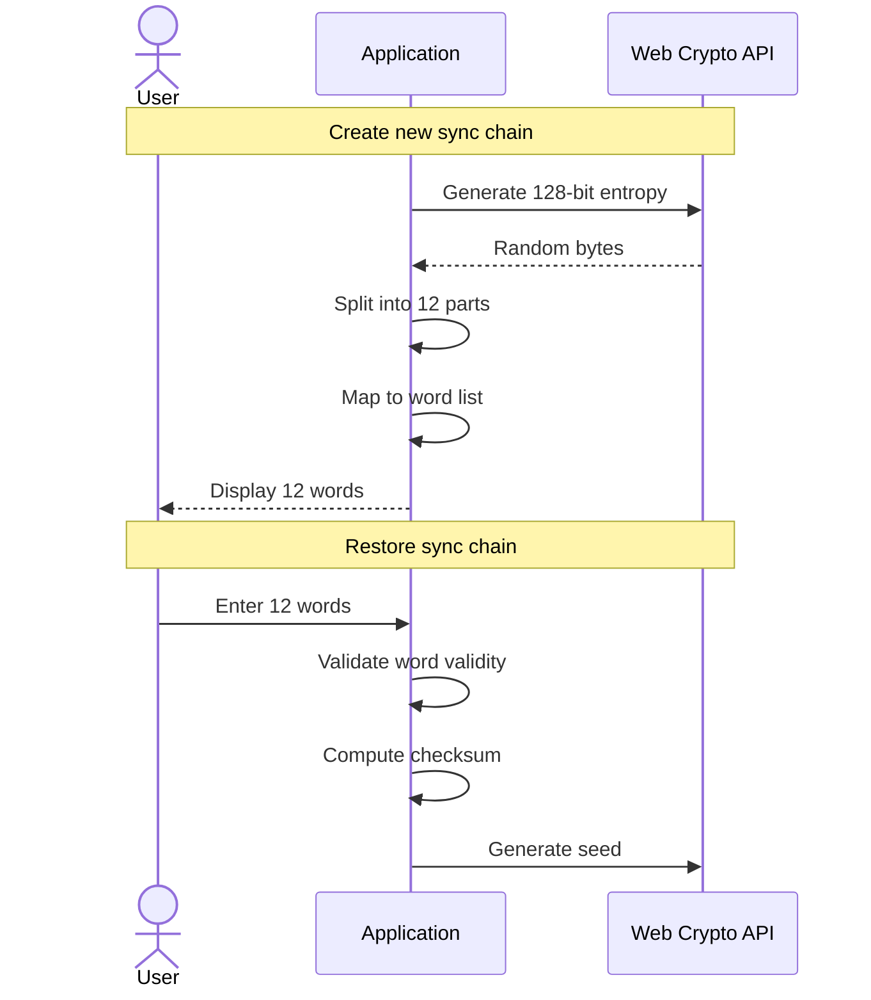
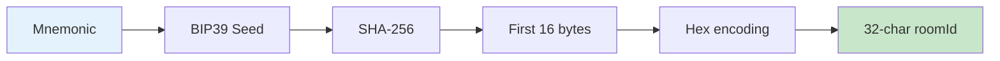
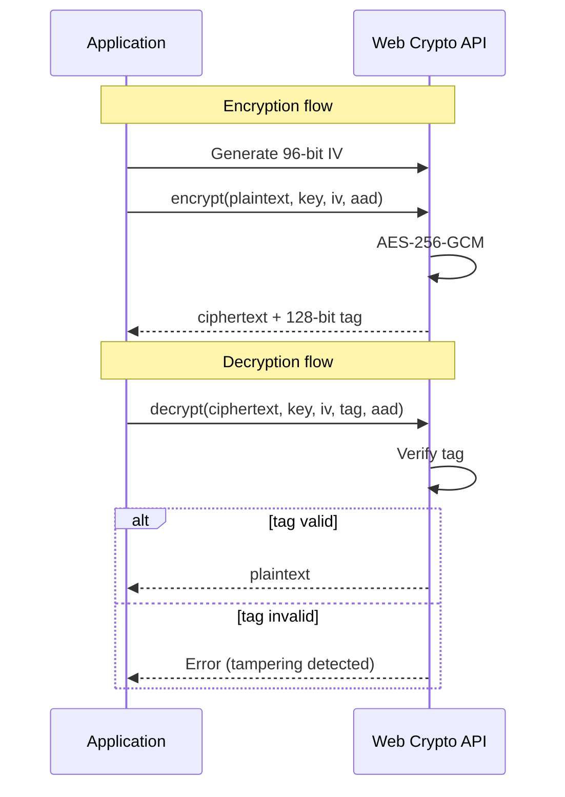
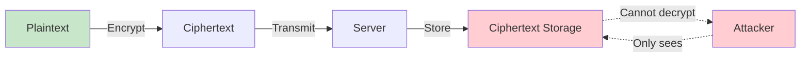
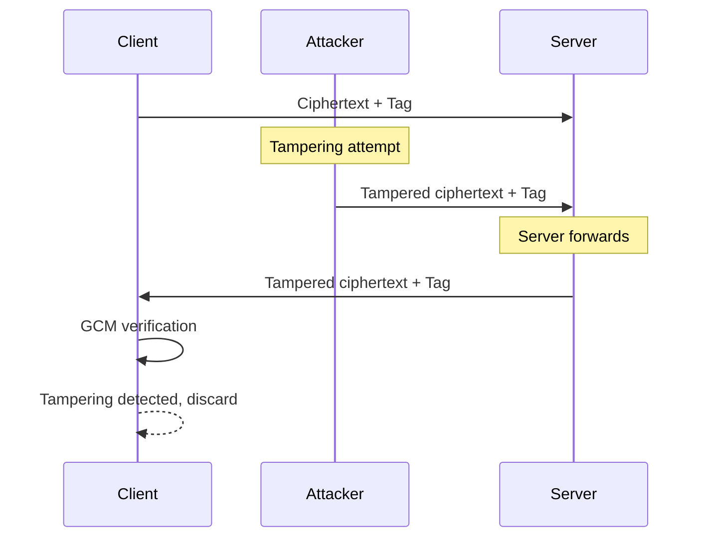
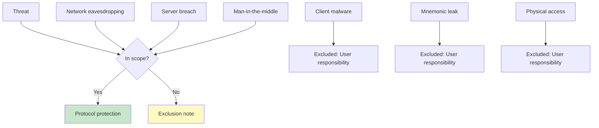

# Encryption Protocol

This document details the design and implementation of Note Sync Now's end-to-end encryption protocol.

## Protocol Overview



## Key Derivation

### BIP39 Mnemonic



**Mnemonic Properties**:

| Property | Value | Description |
|----------|-------|-------------|
| Word count | 12 | BIP39 standard |
| Entropy | 128 bits | Security strength |
| Checksum | 4 bits | Input error detection |
| Word list | BIP39 EN | 2048 words |

### PBKDF2 Key Derivation

```typescript
// Key derivation pseudocode
async function deriveKey(mnemonic: string, roomId: string): Promise<CryptoKey> {
  // 1. Mnemonic to seed
  const seed = bip39.mnemonicToSeedSync(mnemonic)

  // 2. PBKDF2 derivation
  const key = await crypto.subtle.importKey(
    'raw',
    seed,
    'PBKDF2',
    false,
    ['deriveBits', 'deriveKey']
  )

  const derivedKey = await crypto.subtle.deriveKey(
    {
      name: 'PBKDF2',
      salt: new TextEncoder().encode(roomId),
      iterations: 100000,
      hash: 'SHA-256'
    },
    key,
    { name: 'AES-GCM', length: 256 },
    false,
    ['encrypt', 'decrypt']
  )

  return derivedKey
}
```

**Derivation Parameters**:

| Parameter | Value | Security Consideration |
|-----------|-------|------------------------|
| Iterations | 100,000 | GPU brute-force resistance |
| Hash function | SHA-256 | Standard secure hash |
| Salt | roomId | Room isolation |
| Output length | 256 bits | AES-256 key |

### Room ID Generation



## Encryption Algorithm

### AES-256-GCM



**Algorithm Parameters**:

| Parameter | Value | Description |
|-----------|-------|-------------|
| Algorithm | AES-256-GCM | Authenticated encryption |
| Key length | 256 bits | High security strength |
| IV length | 96 bits | Standard recommendation |
| Tag length | 128 bits | Integrity protection |
| AAD | roomId | Room binding |

### Encryption Implementation

```typescript
// Encryption pseudocode
async function encrypt(content: string, key: CryptoKey, roomId: string): Promise<EncryptedData> {
  // 1. Generate random IV
  const iv = crypto.getRandomValues(new Uint8Array(12))

  // 2. Encode plaintext
  const encoded = new TextEncoder().encode(content)

  // 3. AES-GCM encryption
  const ciphertext = await crypto.subtle.encrypt(
    {
      name: 'AES-GCM',
      iv: iv,
      additionalData: new TextEncoder().encode(roomId)
    },
    key,
    encoded
  )

  // 4. Return structured data
  return {
    iv: base64Encode(iv),
    data: base64Encode(ciphertext.slice(0, -16)),  // ciphertext
    tag: base64Encode(ciphertext.slice(-16)),      // auth tag
    roomId: roomId
  }
}
```

### Decryption Implementation

```typescript
// Decryption pseudocode
async function decrypt(encrypted: EncryptedData, key: CryptoKey): Promise<string> {
  // 1. Decode Base64
  const iv = base64Decode(encrypted.iv)
  const ciphertext = concat(
    base64Decode(encrypted.data),
    base64Decode(encrypted.tag)
  )

  // 2. AES-GCM decryption
  const plaintext = await crypto.subtle.decrypt(
    {
      name: 'AES-GCM',
      iv: iv,
      additionalData: new TextEncoder().encode(encrypted.roomId)
    },
    key,
    ciphertext
  )

  // 3. Decode plaintext
  return new TextDecoder().decode(plaintext)
}
```

## Security Properties

### Confidentiality



**Guarantee**: An attacker without the key cannot recover plaintext from ciphertext.

### Integrity



**Guarantee**: Any tampering with ciphertext will be detected, decryption will fail.

### Authentication

Room ID binding via AAD (Additional Authenticated Data):

```typescript
// Bind room during encryption
additionalData: new TextEncoder().encode(roomId)

// Verify room during decryption
// If roomId doesn't match, decryption fails
```

**Guarantee**: Ciphertext cannot be used across rooms.

## Security Assumptions

### Cryptographic Assumptions

| Assumption | Description | Dependency |
|------------|-------------|------------|
| AES-GCM security | AES-GCM is IND-CCA2 secure | Standard assumption |
| PBKDF2 security | High iterations make brute-force infeasible | Computational complexity |
| Random number security | IV generator is cryptographically secure | Web Crypto API |

### Implementation Assumptions

| Assumption | Description | Risk |
|------------|-------------|------|
| Web Crypto API correct | Browser implementation has no vulnerabilities | Low |
| Mnemonic secrecy | User doesn't leak mnemonic | User responsibility |
| Client security | Client code hasn't been tampered with | User responsibility |

### Threat Exclusion



## Protocol Limitations

### Known Limitations

| Limitation | Description | Mitigation |
|------------|-------------|------------|
| No forward secrecy | Key doesn't change | User can regenerate mnemonic |
| No perfect forward secrecy | Relies on computational complexity | High iteration count |
| Single key | One key per room | Room isolation |

### Threats Not Protected

::: warning User Responsibility
The following threats require user self-protection:

1. **Mnemonic leakage**: Do not share mnemonic in insecure environments
2. **Client malware**: Use trusted clients
3. **Physical access**: Protect device physical security
:::

## Implementation Reference

### Key Files

| File | Function |
|------|----------|
| `apps/web/src/utils/crypto/index.js` | Encryption module entry |
| `apps/web/src/utils/crypto/encrypt.js` | Encryption implementation |
| `apps/web/src/utils/crypto/decrypt.js` | Decryption implementation |
| `apps/web/src/utils/crypto/keyDerivation.js` | Key derivation |

### Dependencies

| Library | Purpose | Version |
|---------|---------|---------|
| bip39 | Mnemonic handling | latest |
| Web Crypto API | Encryption primitives | Browser built-in |

---

::: tip Security Audit
This protocol design references best practices from Signal Protocol and Wire Protocol. Professional security audit is recommended before production deployment.
:::
