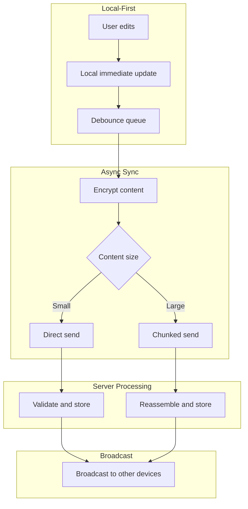
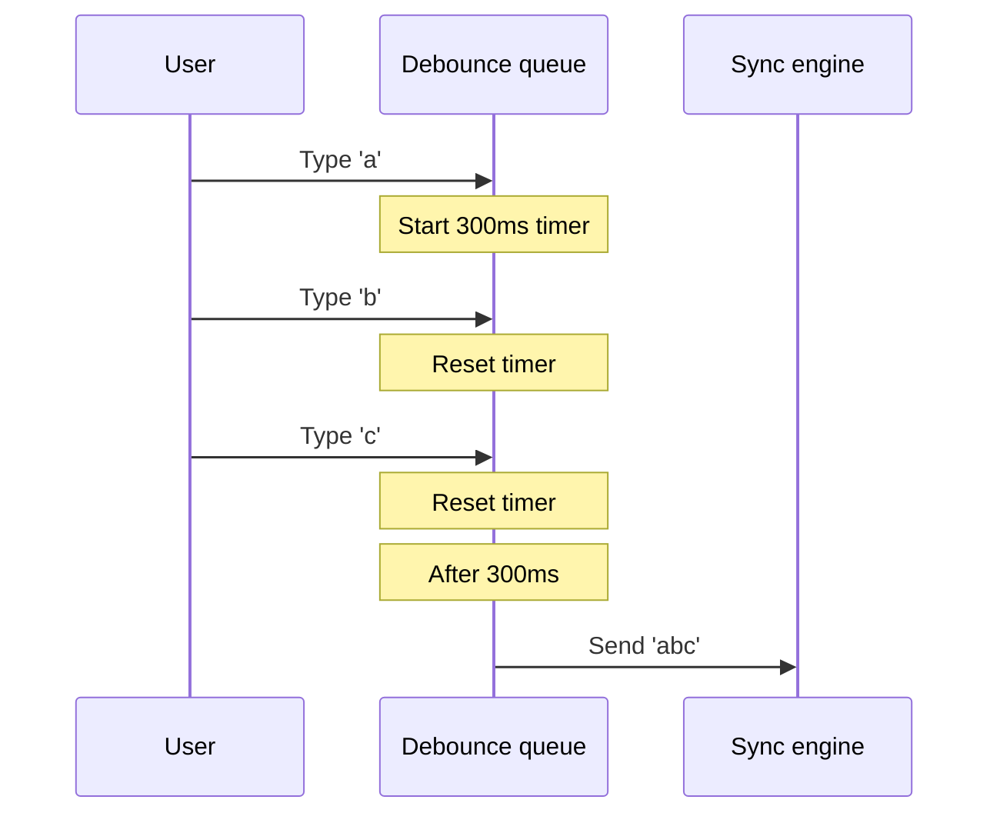
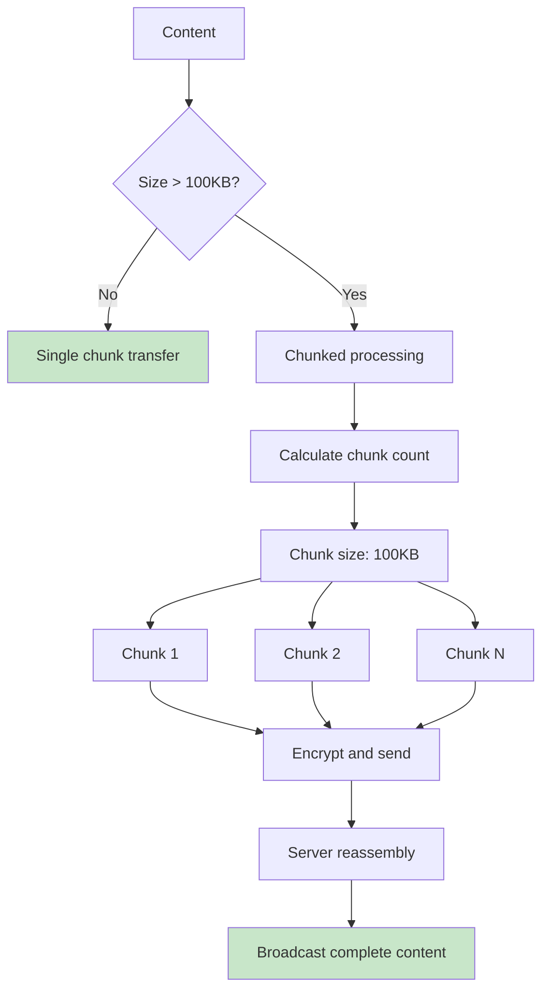
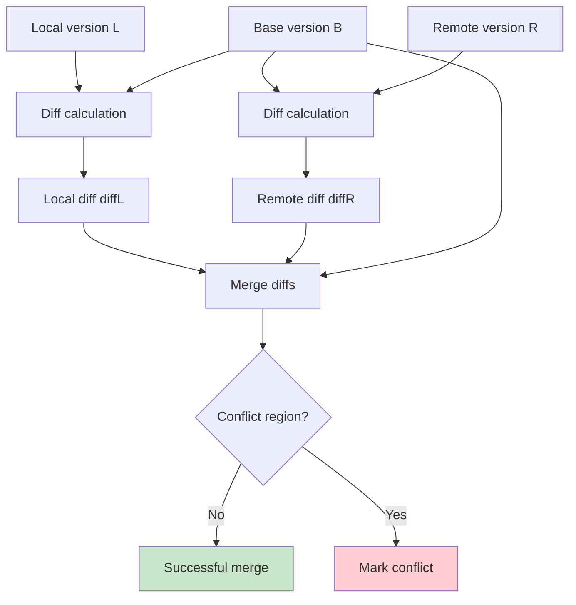
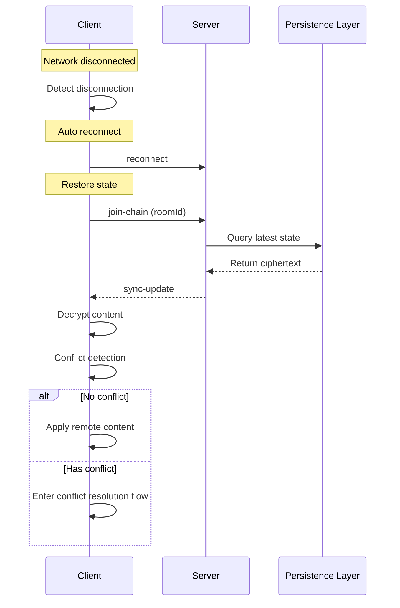
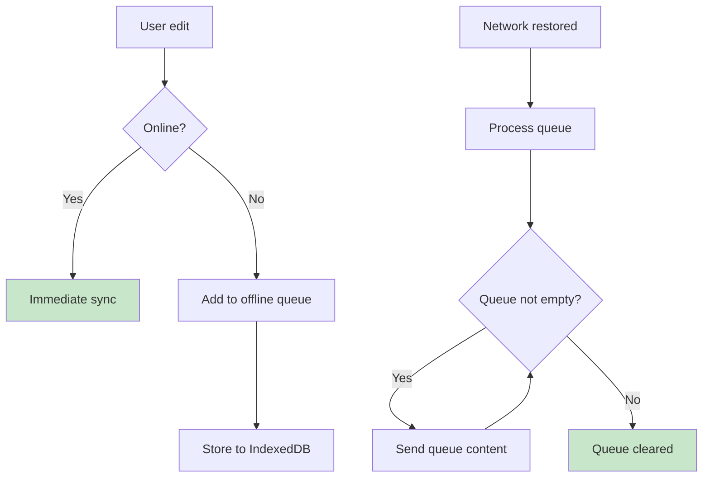
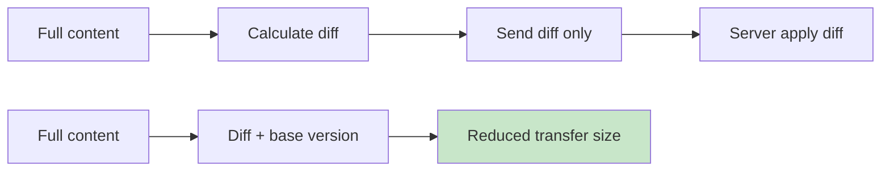

# Sync Algorithm

This document details Note Sync Now's synchronization strategy, chunked transfer, and conflict resolution algorithms.

## Sync Strategy Overview



## Local Update Strategy

### Debounce Mechanism



**Debounce Parameters**:

| Parameter | Value | Description |
|-----------|-------|-------------|
| Delay time | 300ms | Balance responsiveness and efficiency |
| Max wait | 3s | Ensure eventual sync |
| Immediate trigger | Blur/submit | User action complete |

### Local State Management

```typescript
// State update flow
interface NoteState {
  content: string           // Current content
  lastSyncedHash: string    // Last synced hash
  isDirty: boolean          // Has unsynced changes
  pendingUpdate: string | null  // Content to send
}

function onUserInput(newContent: string) {
  state.content = newContent
  state.isDirty = true

  // Add to debounce queue
  debounceQueue.add(() => {
    state.pendingUpdate = newContent
    syncEngine.pushUpdate(newContent)
  })
}
```

## Chunked Transfer Algorithm

### Chunking Strategy



**Chunking Parameters**:

| Parameter | Value | Description |
|-----------|-------|-------------|
| Chunk threshold | 100 KB | Chunk if exceeds this size |
| Chunk size | 100 KB | Size per chunk |
| Max total size | 5 MB | Single update limit |
| Chunk timeout | 30 s | Chunk transfer timeout |

### Chunking Implementation

```typescript
// Chunked send pseudocode
async function sendChunked(content: string, key: CryptoKey, roomId: string) {
  const CHUNK_SIZE = 100 * 1024  // 100 KB
  const encoded = new TextEncoder().encode(content)
  const totalChunks = Math.ceil(encoded.length / CHUNK_SIZE)

  if (totalChunks === 1) {
    // Single chunk direct send
    const encrypted = await encrypt(encoded, key, roomId)
    socket.emit('push-update', { roomId, encryptedData: encrypted })
    return
  }

  // Chunked send
  const sessionId = generateSessionId()

  for (let i = 0; i < totalChunks; i++) {
    const chunk = encoded.slice(i * CHUNK_SIZE, (i + 1) * CHUNK_SIZE)
    const encrypted = await encrypt(chunk, key, roomId)

    socket.emit('push-update', {
      roomId,
      encryptedData: encrypted,
      chunkIndex: i,
      totalChunks,
      sessionId
    })

    // Wait for ack before sending next chunk
    await waitForAck()
  }
}
```

### Server Reassembly

```typescript
// Server reassembly pseudocode
const chunkSessions = new Map<string, ChunkSession>()

function handleChunkedUpdate(data: PushUpdate) {
  if (!data.chunkIndex) {
    // Single chunk direct processing
    processUpdate(data)
    return
  }

  // Chunk reassembly
  const session = chunkSessions.get(data.sessionId) || createSession(data)
  session.chunks[data.chunkIndex] = data.encryptedData

  if (session.isComplete()) {
    const fullData = session.reassemble()
    processUpdate({ ...data, encryptedData: fullData })
    chunkSessions.delete(data.sessionId)
  }

  // Timeout cleanup
  setTimeout(() => chunkSessions.delete(data.sessionId), 30000)
}
```

## Conflict Detection Algorithm

### Version Vector

```mermaid
graph LR
    subgraph Device A
        A1[v1: "Hello"] --> A2[v2: "Hello World"]
    end

    subgraph Device B
        B1[v1: "Hello"] --> B2[v2: "Hello!"]
    end

    A2 --> C{Conflict detection}
    B2 --> C

    C --> D[Base version: v1]
    C --> E[Local change: "World"]
    C --> F[Remote change: "!"]

    style C fill:#fff9c4
```

### Hash Comparison

```typescript
// Conflict detection pseudocode
interface ConflictState {
  localHash: string      // Local content hash
  baseHash: string       // Base version hash
  remoteHash: string     // Remote content hash
}

function detectConflict(state: ConflictState): ConflictResult {
  // No conflict: remote matches local
  if (state.localHash === state.remoteHash) {
    return { type: 'none' }
  }

  // Local unchanged: apply remote directly
  if (state.localHash === state.baseHash) {
    return { type: 'apply-remote' }
  }

  // Remote is old version: ignore
  if (state.remoteHash === state.baseHash) {
    return { type: 'ignore-remote' }
  }

  // True conflict: needs merge
  return { type: 'conflict', needsMerge: true }
}
```

## Three-Way Merge Algorithm

### Algorithm Principle



### Merge Implementation

```typescript
// Three-way merge pseudocode
function threeWayMerge(
  local: string,
  base: string,
  remote: string
): MergeResult {
  // 1. Calculate diffs
  const localDiff = diff(base, local)   // B → L diff
  const remoteDiff = diff(base, remote) // B → R diff

  // 2. Attempt merge
  const conflicts: Conflict[] = []
  const merged: string[] = []

  // Iterate all regions
  for (const region of allRegions(localDiff, remoteDiff)) {
    if (region.onlyLocal) {
      // Only local change: apply local
      merged.push(region.localChange)
    } else if (region.onlyRemote) {
      // Only remote change: apply remote
      merged.push(region.remoteChange)
    } else if (region.localChange === region.remoteChange) {
      // Same change: pick either
      merged.push(region.localChange)
    } else {
      // Conflict: mark and keep both
      conflicts.push({
        position: region.position,
        local: region.localChange,
        remote: region.remoteChange,
        base: region.baseContent
      })
      merged.push(markConflict(region))
    }
  }

  return {
    content: merged.join(''),
    conflicts,
    hasConflicts: conflicts.length > 0
  }
}
```

### Conflict Marker Format

```
<<<<<<< LOCAL
Local modified content
=======
Remote modified content
>>>>>>> REMOTE
```

## Reconnection Recovery Mechanism

### Reconnection Flow



### Offline Queue



**Offline Queue Properties**:

| Property | Value | Description |
|----------|-------|-------------|
| Storage | IndexedDB | Persistent |
| Max entries | 100 | Prevent unbounded growth |
| Merge strategy | Last valid | Keep only latest per note |

## Performance Optimization

### Incremental Sync



**Optimization Effect**:

| Scenario | No optimization | Incremental sync |
|----------|-----------------|------------------|
| Small edit (10B) | Send 1MB | Send ~100B |
| Large doc (1MB) | Send 1MB each time | Send diff only |

### Compression

```typescript
// Optional compression layer
async function compressAndEncrypt(content: string): Promise<string> {
  // 1. Compress
  const compressed = await compress(content)  // gzip/brotli

  // 2. Encrypt
  const encrypted = await encrypt(compressed)

  return encrypted
}
```

---

::: tip Algorithm Selection
The current implementation uses simplified three-way merge. For more complex collaboration scenarios, consider:
- OT (Operational Transformation)
- CRDT (Conflict-free Replicated Data Types)
:::
