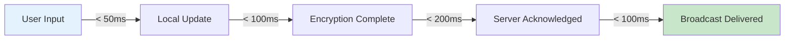
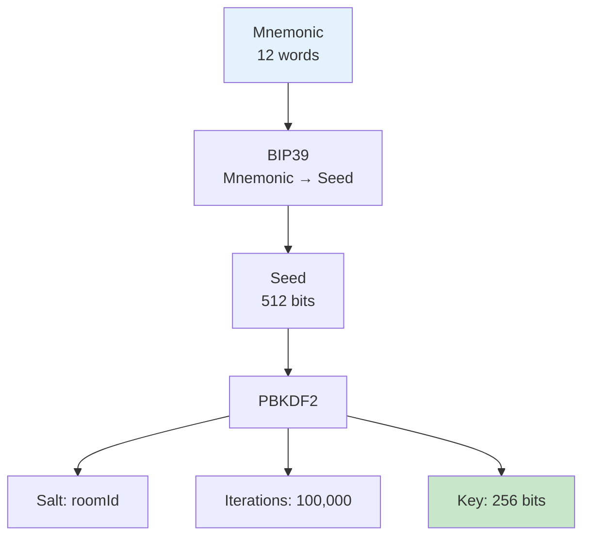
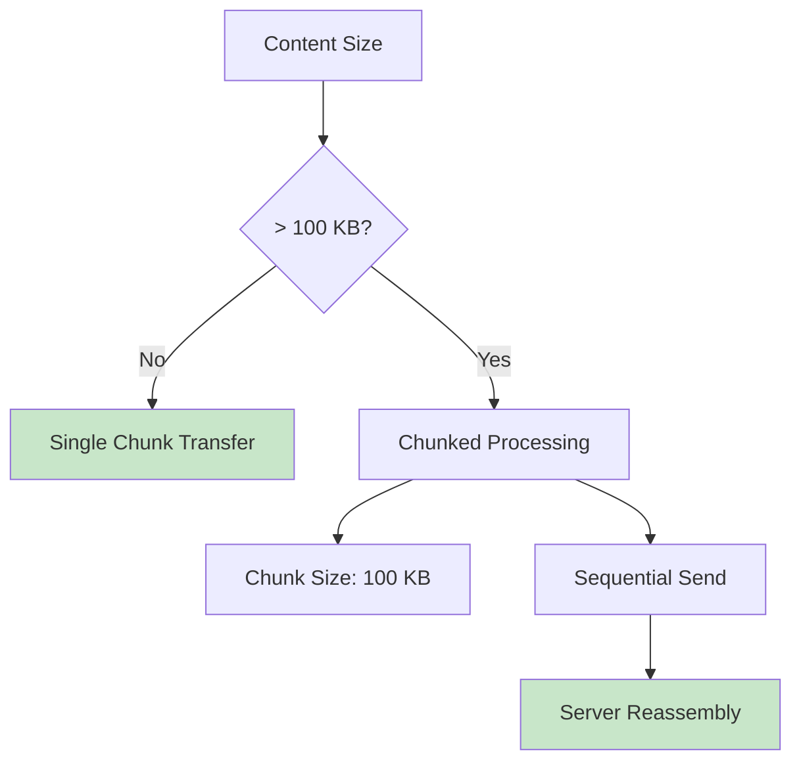
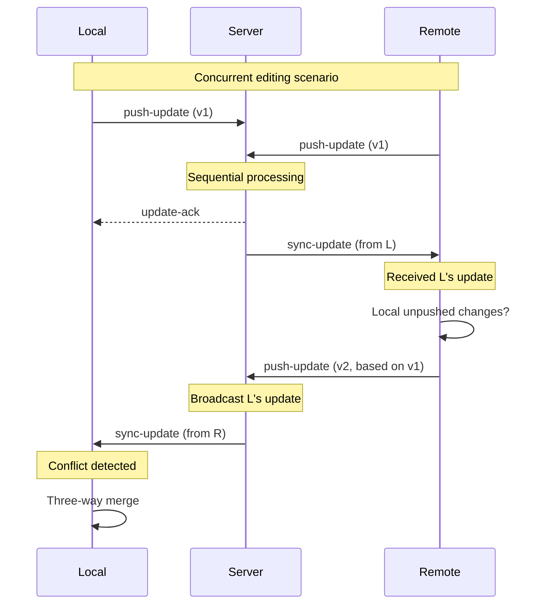
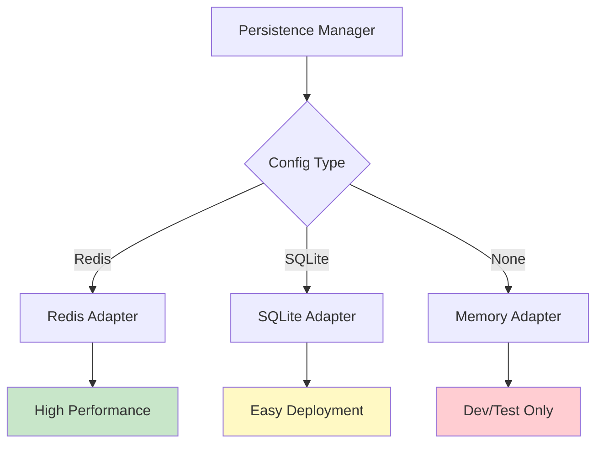
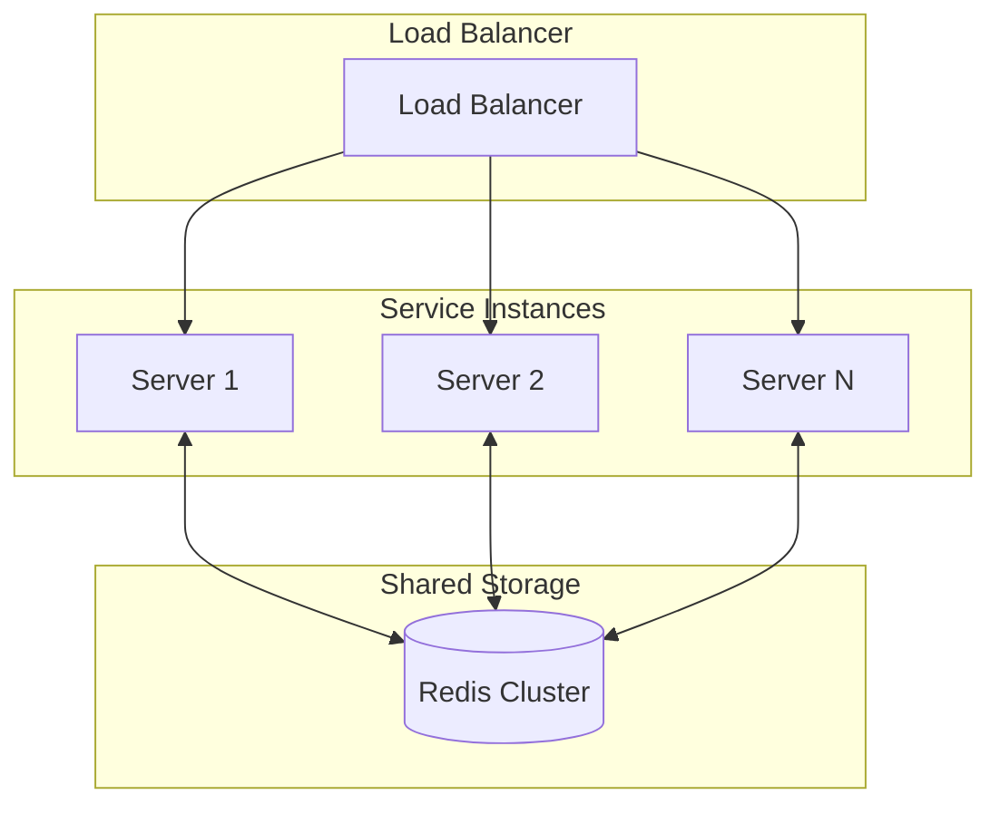

# Technical Specification

This document defines the technical specifications, performance metrics, and design constraints for Note Sync Now.

## System Requirements

### Client

| Item | Minimum | Recommended |
|------|---------|-------------|
| Browser | Chrome 90+, Firefox 88+, Safari 14+ | Latest stable version |
| Memory | 256 MB available | 512 MB+ |
| Storage | 50 MB IndexedDB | 200 MB+ |
| Network | Stable connection | WebSocket support |

### Server

| Item | Minimum | Recommended |
|------|---------|-------------|
| Node.js | 18.x | 20.x LTS |
| Memory | 512 MB | 2 GB+ |
| Storage | 1 GB | 10 GB+ (depends on user volume) |
| Redis | 6.x (optional) | 7.x |

## Performance Specifications

### Sync Latency



| Metric | Target | Measurement |
|--------|--------|-------------|
| Local update latency | < 50ms | Input to UI update |
| Encryption time | < 100ms | Encrypt 1MB content |
| Network round-trip | < 200ms | Client to server |
| End-to-end sync | < 500ms | Input to remote display |

### Throughput

| Scenario | Metric |
|----------|--------|
| Per-room concurrency | 100+ devices |
| Per-server connections | 10,000+ WebSocket |
| Update throughput | 1,000 updates/sec |
| Max content size | 5 MB / update |

## Encryption Specifications

### Key Derivation



| Parameter | Value | Description |
|-----------|-------|-------------|
| Mnemonic length | 12 words | 128-bit entropy |
| PBKDF2 iterations | 100,000 | Brute-force resistance |
| Derived key length | 256 bits | AES-256 |
| Salt | roomId | Room isolation |

### Encryption Parameters

| Parameter | Value | Description |
|-----------|-------|-------------|
| Algorithm | AES-256-GCM | Authenticated encryption |
| IV length | 96 bits | Standard length |
| Tag length | 128 bits | Integrity protection |
| Associated data | roomId | Additional binding |

## Sync Specifications

### Message Format

```typescript
// WebSocket message types
interface JoinChain {
  event: 'join-chain'
  roomId: string      // 32-character hexadecimal
  deviceName: string  // 1-50 characters
}

interface PushUpdate {
  event: 'push-update'
  roomId: string
  encryptedData: string  // Base64-encoded ciphertext
  chunkIndex?: number    // Chunk index (optional)
  totalChunks?: number   // Total chunks (optional)
}

interface SyncUpdate {
  event: 'sync-update'
  encryptedData: string
  fromDevice: string
  timestamp: number
}

interface UpdateAck {
  event: 'update-ack'
  success: boolean
  timestamp: number
}
```

### Chunking Strategy



| Parameter | Value |
|-----------|-------|
| Chunk threshold | 100 KB |
| Chunk size | 100 KB |
| Max total size | 5 MB |
| Chunk timeout | 30 seconds |

### Conflict Detection



## Storage Specifications

### Client Storage

| Storage | Purpose | Size Limit |
|---------|---------|------------|
| IndexedDB | Note content, history | Browser quota |
| LocalStorage | Settings, key cache | ~5 MB |
| SessionStorage | Temporary state | ~5 MB |

### Server Storage



| Storage Backend | Use Case | Persistent |
|-----------------|----------|------------|
| Redis | Production, high concurrency | ✅ |
| SQLite | Small-scale deployment | ✅ |
| Memory | Development & testing | ❌ |

## Server Protection Specifications

### Input Validation

```typescript
// Validation rules
const validators = {
  roomId: /^[a-f0-9]{32}$/,           // 32-character hexadecimal
  deviceName: /^.{1,50}$/,            // 1-50 characters
  encryptedData: /^.{1,7000000}$/,    // Base64, < 5MB raw
}
```

### Rate Limiting

| Limit Type | Threshold | Window |
|------------|-----------|--------|
| Update rate | 30 requests | 1 minute |
| Connection rate | 10 requests | 1 minute |
| Room creation | 5 requests | 1 hour |

### Resource Limits

| Resource | Limit | Overflow Handling |
|----------|-------|-------------------|
| Room count | 10,000 | LRU eviction |
| Devices per room | 100 | Reject join |
| Room idle TTL | 24 hours | Auto cleanup |

## Scalability Specifications

### Horizontal Scaling



### Extension Points

| Extension Point | Current Status | Extension Method |
|-----------------|---------------|------------------|
| Multi-note | Architecture reserved | State management extension |
| Version history | Persistence supported | Add version field |
| Collaboration permissions | Not implemented | Permission model design |
| End-to-end testing | Partial | Test coverage improvement |

## Compatibility Specifications

### Browser Compatibility

| Feature | Chrome | Firefox | Safari | Edge |
|---------|--------|---------|--------|------|
| WebSocket | ✅ 90+ | ✅ 88+ | ✅ 14+ | ✅ 90+ |
| IndexedDB | ✅ 90+ | ✅ 88+ | ✅ 14+ | ✅ 90+ |
| Web Crypto | ✅ 90+ | ✅ 88+ | ✅ 14+ | ✅ 90+ |
| ES Modules | ✅ 90+ | ✅ 88+ | ✅ 14+ | ✅ 90+ |

### API Stability

| API | Stability | Change Policy |
|-----|-----------|---------------|
| WebSocket events | Stable | Semantic versioning |
| REST endpoints | Stable | Semantic versioning |
| Message format | Stable | Backward compatible |
| Config format | Stable | Backward compatible |

---

::: tip Version Note
This specification corresponds to v2.2.0. Future version changes will update this document.
:::
