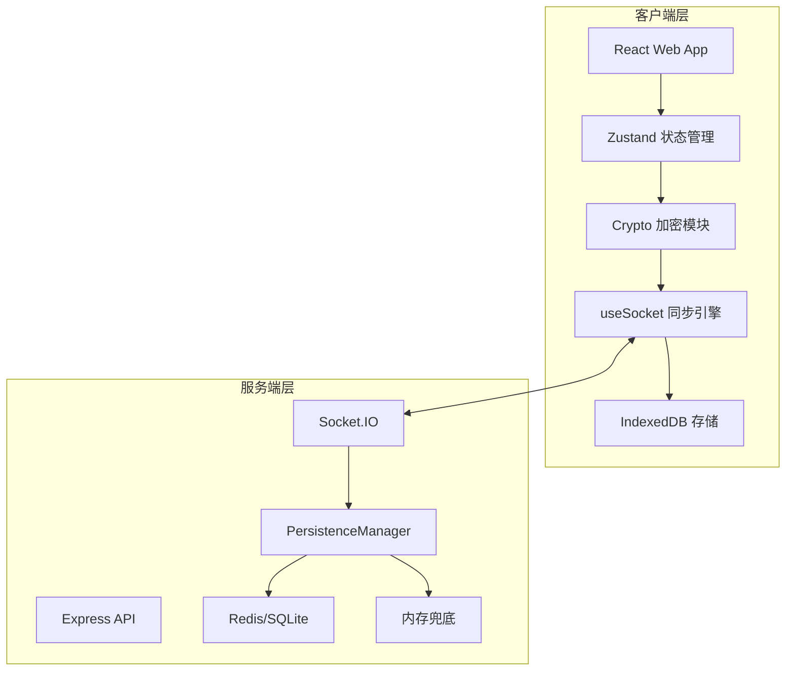
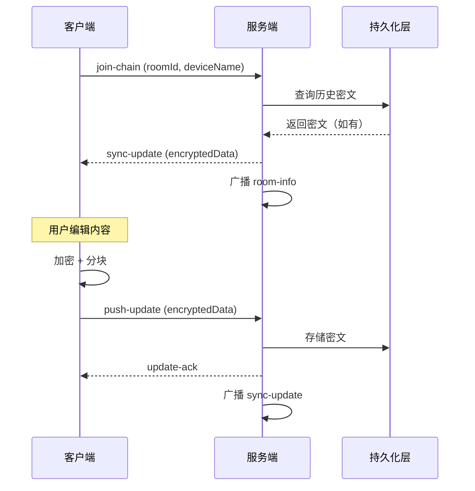

## 系统架构



## 核心技术特性

| 特性 | 实现方式 | 安全等级 |
|------|---------|---------|
| 加密算法 | AES-256-GCM | military-grade |
| 密钥派生 | PBKDF2 (100,000 iterations) | 抗暴力破解 |
| 同步协议 | WebSocket + 分块传输 | 低延迟 |
| 冲突解决 | 三路合并算法 | 无数据丢失 |
| 存储策略 | IndexedDB + 持久化回退 | 离线可用 |

## 同步流程时序



## 技术栈

<div class="tech-stack">

| 层级 | 技术 |
|------|------|
| 前端框架 | React 18 + Vite 5 |
| 状态管理 | Zustand |
| 加密库 | Web Crypto API |
| 本地存储 | IndexedDB |
| 服务端 | Express + Socket.IO |
| 持久化 | Redis / SQLite |
| 容器化 | Docker |

</div>

## 快速开始

::: code-group
```bash [Docker]
docker run -p 3002:3002 lessup/note-sync-server
```

```bash [源码构建]
git clone https://github.com/AICL-Lab/brave-sync-notes
cd brave-sync-notes
npm install && npm run dev
```
:::

## 文档导航

- [架构说明](/zh-CN/architecture) - 系统边界、核心模块、同步数据流
- [安全机制](/zh-CN/security-sync) - 加密边界、防护措施、威胁模型
- [加密协议](/zh-CN/crypto-protocol) - 密钥派生、加密流程、安全假设
- [同步算法](/zh-CN/sync-algorithm) - 分块传输、冲突解决、重连恢复
- [API 设计](/zh-CN/api-design) - WebSocket 事件、REST 接口

<style>
.tech-stack table {
  width: 100%;
  border-radius: 8px;
}
.tech-stack th,
.tech-stack td {
  padding: 0.5rem 1rem;
}
</style>