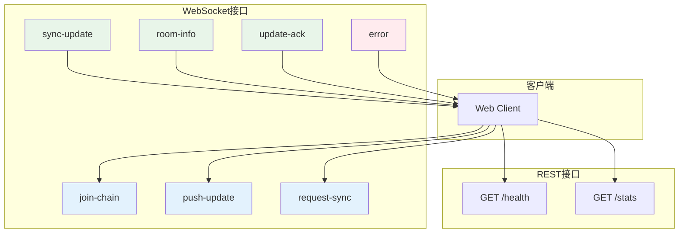
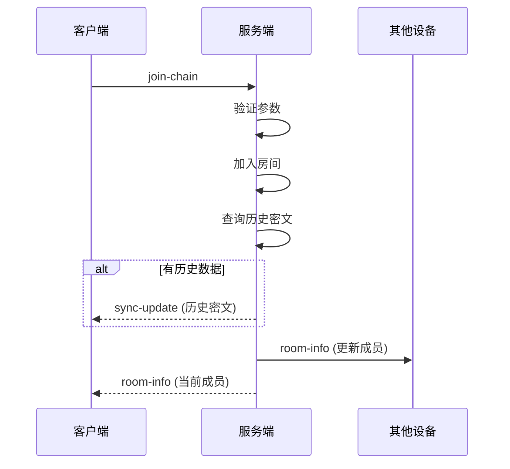
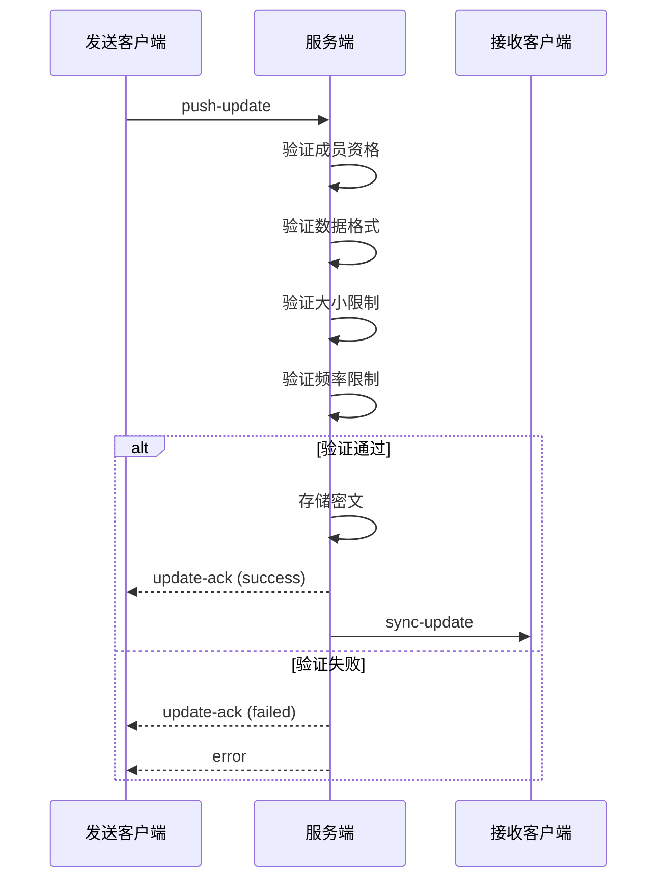
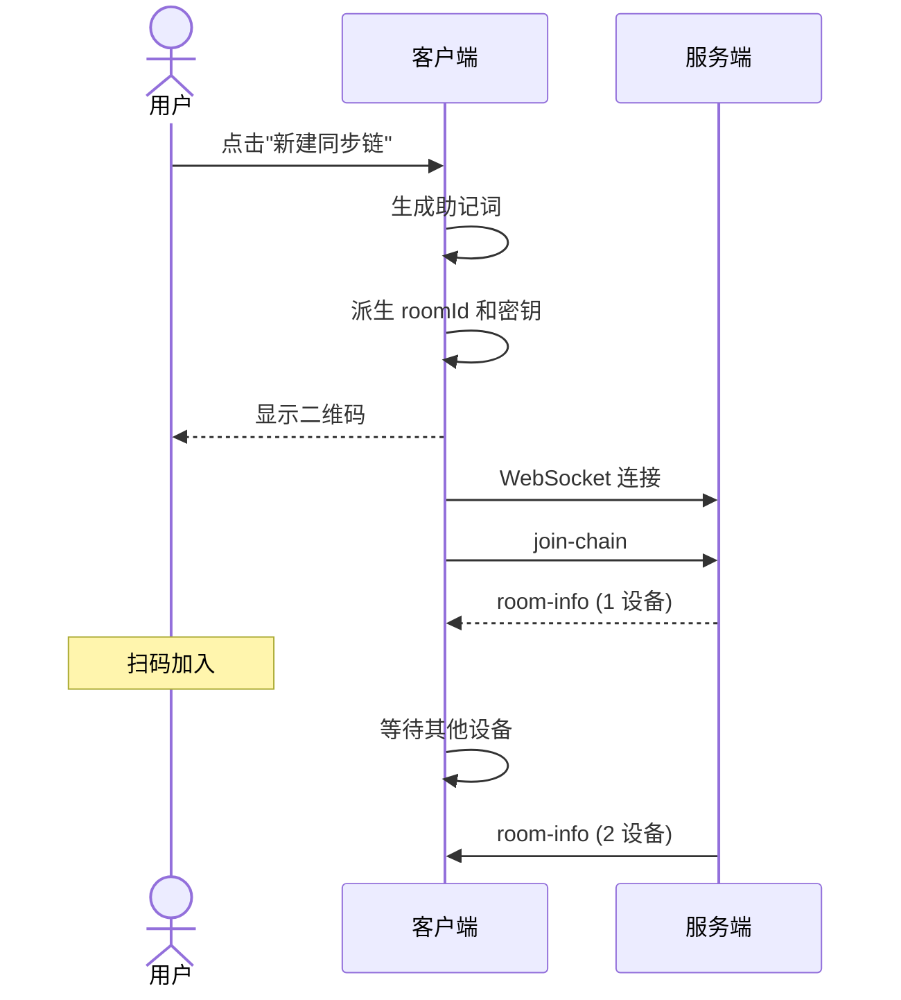
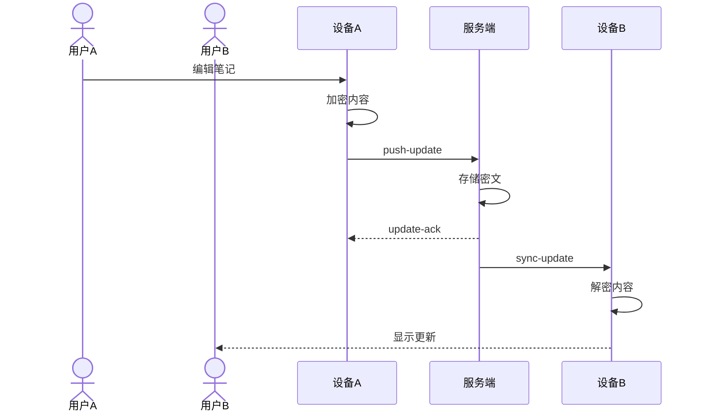
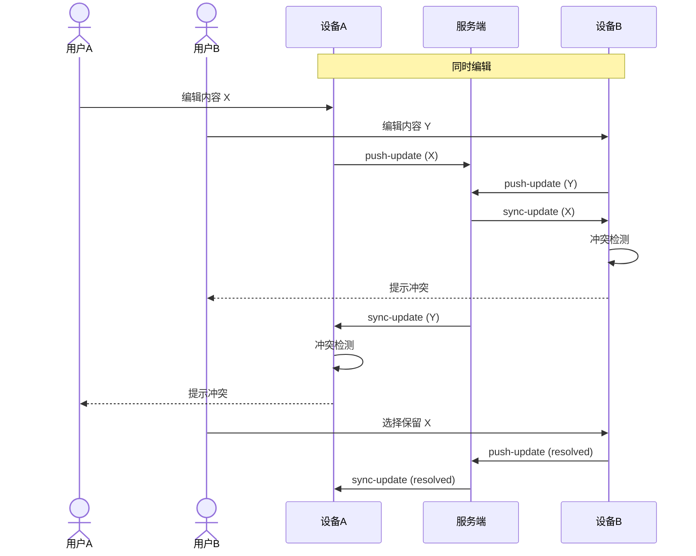
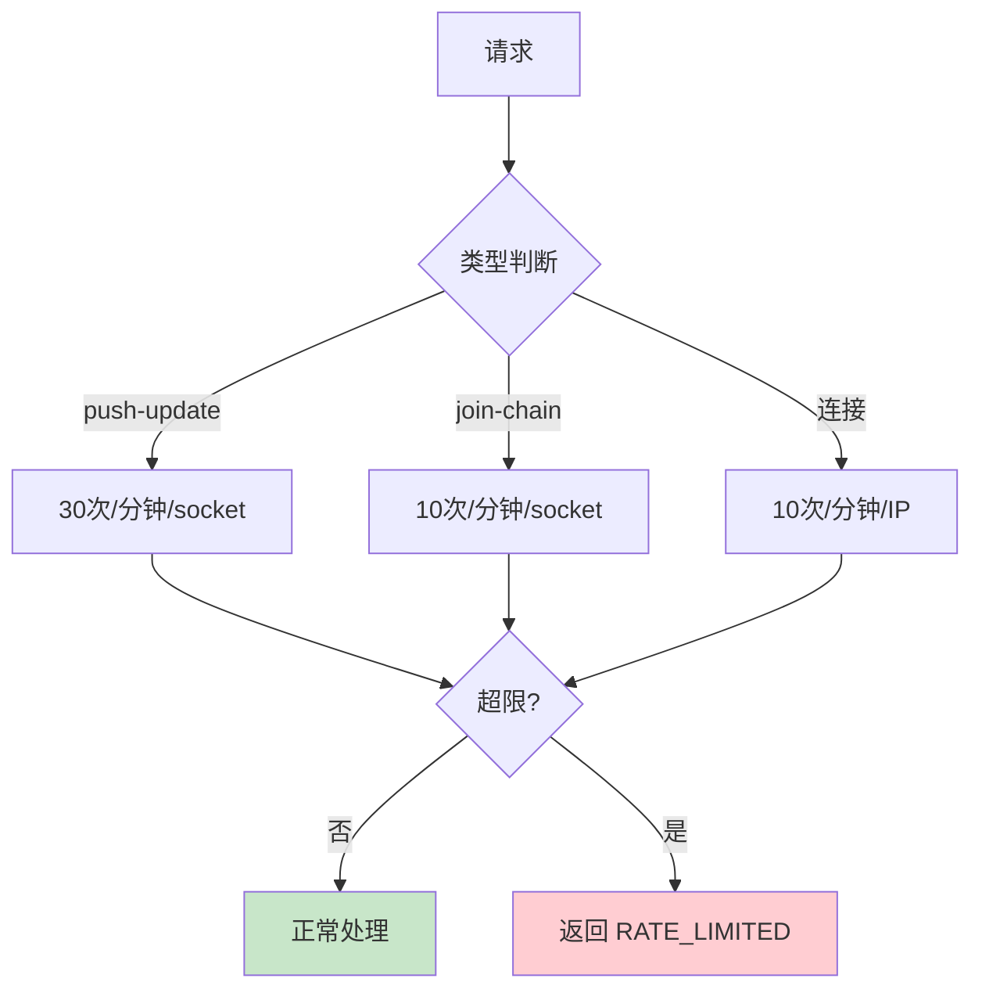

# API 设计文档

本文档定义 Note Sync Now 的完整 API 接口规范。

## 接口总览



## WebSocket 接口

### 连接

```
ws://<host>:<port>/
```

**连接参数**：

| 参数 | 默认值 | 说明 |
|------|-------|------|
| `transports` | `['websocket']` | 仅 WebSocket |
| `reconnection` | `true` | 自动重连 |
| `reconnectionDelay` | `1000ms` | 重连延迟 |
| `reconnectionAttempts` | `Infinity` | 无限重试 |

### join-chain

加入一个同步链（房间）。

```typescript
// 客户端发送
socket.emit('join-chain', {
  roomId: string,      // 房间ID，32字符十六进制
  deviceName: string   // 设备名称，1-50字符
})

// 服务端响应
// 1. 如果房间有历史数据
socket.emit('sync-update', {
  encryptedData: string,  // Base64编码密文
  fromDevice: 'server',   // 来源标识
  timestamp: number       // 时间戳
})

// 2. 广播房间信息
socket.emit('room-info', {
  roomId: string,
  devices: string[],      // 当前设备列表
  memberCount: number     // 成员数
})
```

**验证规则**：

| 字段 | 规则 | 错误码 |
|------|------|--------|
| roomId | 32字符十六进制 | `INVALID_ROOM_ID` |
| deviceName | 1-50字符 | `INVALID_DEVICE_NAME` |

**时序图**：



### push-update

推送加密更新到房间。

```typescript
// 客户端发送
socket.emit('push-update', {
  roomId: string,              // 房间ID
  encryptedData: string,       // Base64编码密文
  chunkIndex?: number,         // 分块索引（分块模式）
  totalChunks?: number,        // 总块数（分块模式）
  sessionId?: string           // 分块会话ID
})

// 服务端确认
socket.emit('update-ack', {
  success: boolean,
  timestamp: number,
  error?: string               // 失败原因
})

// 广播到其他成员
socket.emit('sync-update', {
  encryptedData: string,
  fromDevice: string,
  timestamp: number
})
```

**验证规则**：

| 字段 | 规则 | 错误码 |
|------|------|--------|
| roomId | 已加入的房间 | `NOT_IN_ROOM` |
| encryptedData | 非空字符串 | `INVALID_DATA` |
| 数据大小 | < 5 MB | `DATA_TOO_LARGE` |
| 频率 | 30次/分钟 | `RATE_LIMITED` |

**时序图**：



### request-sync

主动请求最新同步数据。

```typescript
// 客户端发送
socket.emit('request-sync', {
  roomId: string
})

// 服务端响应
socket.emit('sync-update', {
  encryptedData: string,
  fromDevice: 'server',
  timestamp: number
})
```

**使用场景**：

- 断线重连后恢复
- 切换到前台时检查更新
- 手动刷新

### sync-update

接收同步更新（服务端推送）。

```typescript
// 服务端推送
socket.on('sync-update', (data: {
  encryptedData: string,   // Base64编码密文
  fromDevice: string,      // 来源设备
  timestamp: number        // 时间戳
}) => {
  // 1. 解密内容
  // 2. 冲突检测
  // 3. 更新本地状态
})
```

### room-info

房间成员信息更新。

```typescript
// 服务端推送
socket.on('room-info', (data: {
  roomId: string,
  devices: Array<{
    name: string,
    joinedAt: number
  }>,
  memberCount: number
}) => {
  // 更新UI显示
})
```

### update-ack

服务端确认收到更新。

```typescript
// 服务端响应
socket.on('update-ack', (data: {
  success: boolean,
  timestamp: number,
  error?: string
}) => {
  if (data.success) {
    // 更新 lastSyncedHash
  } else {
    // 处理错误
  }
})
```

### error

服务端错误通知。

```typescript
// 服务端推送
socket.on('error', (data: {
  code: string,
  message: string,
  details?: any
}) => {
  // 处理错误
})
```

**错误码**：

| 错误码 | 说明 | 客户端处理 |
|--------|------|-----------|
| `INVALID_ROOM_ID` | 房间ID格式错误 | 检查输入 |
| `INVALID_DEVICE_NAME` | 设备名格式错误 | 检查输入 |
| `INVALID_DATA` | 数据格式错误 | 检查加密流程 |
| `NOT_IN_ROOM` | 未加入房间 | 重新 join-chain |
| `DATA_TOO_LARGE` | 数据超过 5MB | 启用分块 |
| `RATE_LIMITED` | 频率超限 | 退避重试 |
| `ROOM_FULL` | 房间满员 | 等待或换房间 |
| `INTERNAL_ERROR` | 服务端内部错误 | 重试 |

## REST 接口

### GET /health

健康检查端点。

```typescript
// 请求
GET /health

// 响应 200
{
  "status": "ok",
  "connections": number,      // 当前连接数
  "rooms": number,            // 房间数
  "persistence": {
    "type": "redis" | "sqlite" | "memory",
    "connected": boolean
  },
  "uptime": number            // 运行时间（秒）
}
```

**用途**：
- 容器健康检查
- 负载均衡器探活
- 监控告警

### GET /stats

统计信息端点。

```typescript
// 请求
GET /stats

// 响应 200
{
  "connections": number,        // 当前连接数
  "rooms": number,              // 活跃房间数
  "memory": {
    "heapUsed": number,         // 堆使用量（字节）
    "heapTotal": number,        // 堆总量（字节）
    "rss": number               // RSS（字节）
  },
  "persistence": {
    "type": string,             // 存储类型
    "connected": boolean,       // 连接状态
    "keys": number              // 存储的密钥数
  }
}
```

**用途**：
- 运维监控
- 容量规划
- 问题排查

## 接口交互完整流程

### 新建同步链



### 实时同步



### 冲突解决



## 速率限制详情



## 实现参考

### 关键文件

| 文件 | 功能 |
|------|------|
| `apps/api/index.js` | 服务端入口、事件处理 |
| `apps/web/src/hooks/useSocket.js` | 客户端同步引擎 |
| `apps/api/src/persistence/PersistenceManager.js` | 持久化管理 |
| `apps/api/src/persistence/PersistenceAdapter.js` | 存储适配器 |

---

::: tip API 版本
当前 API 版本为 v1。后续版本将遵循语义化版本控制，确保向后兼容。
:::
