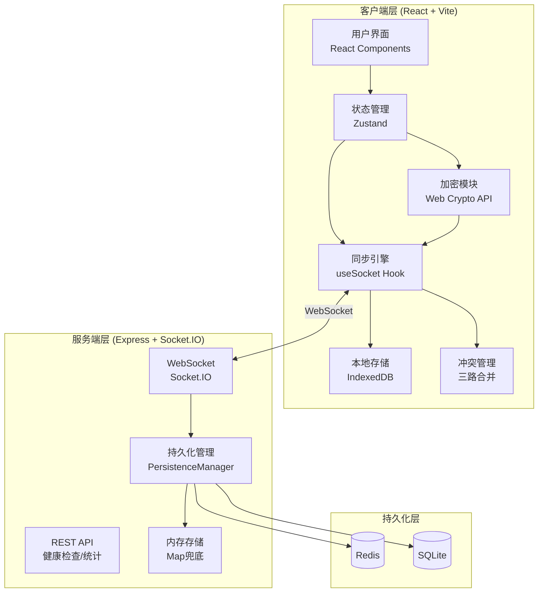
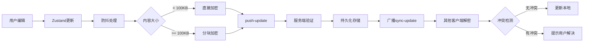
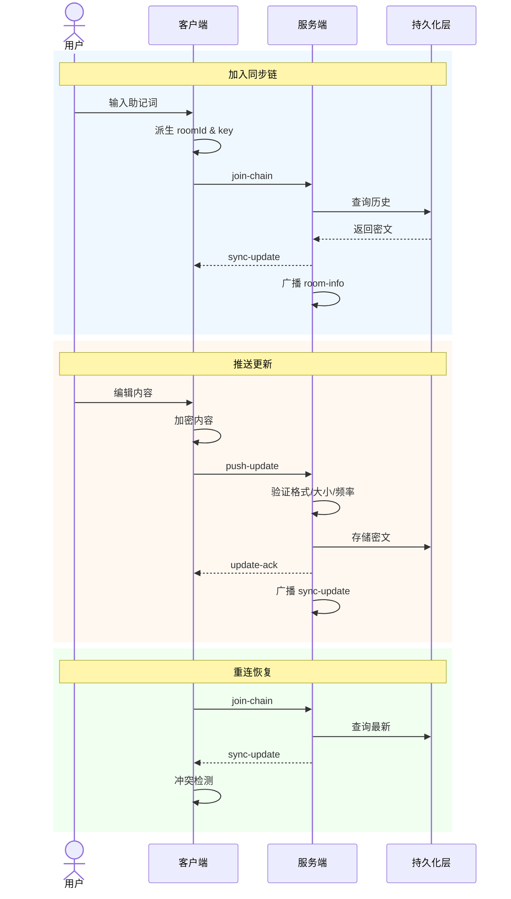

# 架构说明

Note Sync Now 采用端到端加密架构，客户端负责加密与冲突处理，服务端仅作为密文中转站。

## 系统架构图

## 核心架构原则

### 1. 端到端加密优先

笔记内容在客户端加密，服务端只接收密文。即使服务端被攻破，攻击者也无法解密内容。

### 2. 助记词驱动恢复

客户端通过 BIP39 助记词派生房间 ID 和加密密钥，用户只需记住 12 个单词即可恢复所有数据。

### 3. 服务端尽量无状态

服务端聚焦同步转发、短期内存态与持久化兜底，不处理任何明文逻辑。

### 4. 冲突显式处理

本地编辑与远端更新冲突时，不把所有情况简化为覆盖写入，而是通过三路合并算法检测冲突，提示用户手动解决。

### 5. 多层存储退化

优先使用持久化存储（Redis/SQLite），不可用时回退到内存模式，保证服务可用性。

## 同步数据流

## 模块职责边界

### 客户端职责

| 模块 | 职责 | 关键文件 |
|------|------|---------|
| 用户界面 | React 组件、交互逻辑 | `apps/web/src/App.jsx` |
| 状态管理 | Zustand store、状态同步 | `apps/web/src/store/useStore.js` |
| 加密模块 | 密钥派生、加密解密 | `apps/web/src/utils/crypto` |
| 同步引擎 | Socket 连接、事件处理 | `apps/web/src/hooks/useSocket.js` |
| 冲突管理 | 差异检测、合并策略 | `apps/web/src/utils/conflict` |
| 本地存储 | IndexedDB 读写、离线队列 | `apps/web/src/utils/storage` |

### 服务端职责

| 模块 | 职责 | 关键文件 |
|------|------|---------|
| REST API | 健康检查、统计接口 | `apps/api/index.js` |
| WebSocket | 房间管理、事件分发 | `apps/api/index.js` |
| 持久化 | 存储适配、数据迁移 | `apps/api/src/persistence/` |

## 关键事件模型

## 扩展性设计

### 水平扩展

- 服务端无状态设计，可水平扩展
- Redis 作为共享存储，支持多实例
- Socket.IO 支持集群模式

### 功能扩展

- 多笔记支持：已有架构预留空间
- 离线队列：IndexedDB 已实现基础能力
- 版本历史：持久化层支持版本标记

## 推荐阅读顺序

1. 当前页面：架构说明
2. [安全与同步机制](/zh-CN/security-sync)
3. [加密协议详解](/zh-CN/crypto-protocol)
4. [同步算法说明](/zh-CN/sync-algorithm)
5. [API 设计文档](/zh-CN/api-design)
