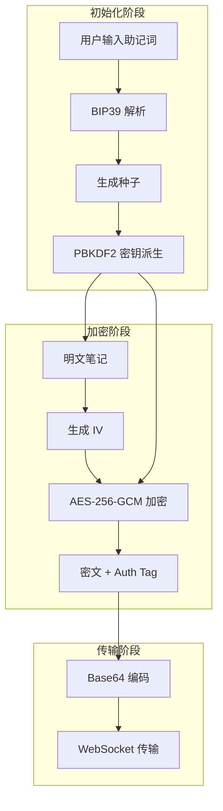
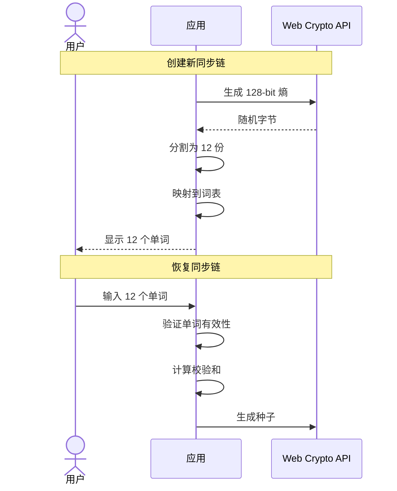
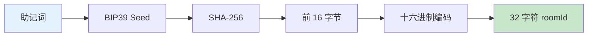
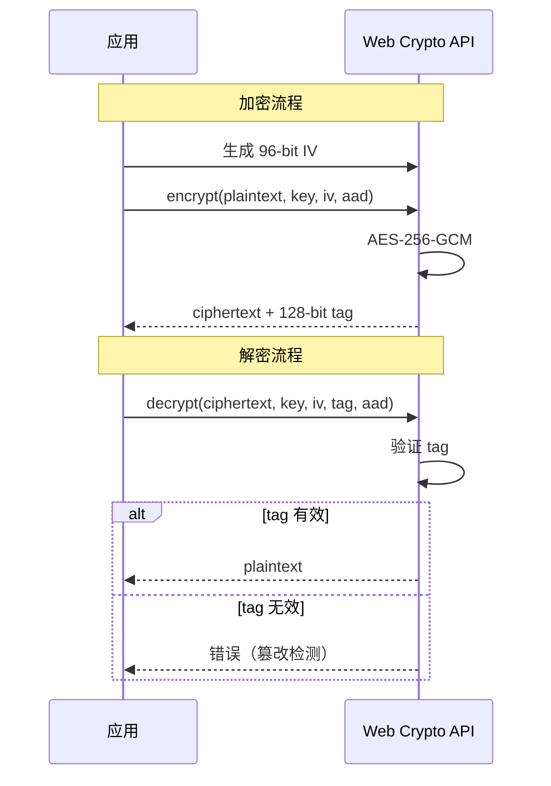
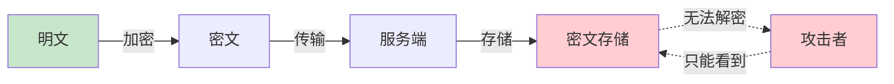
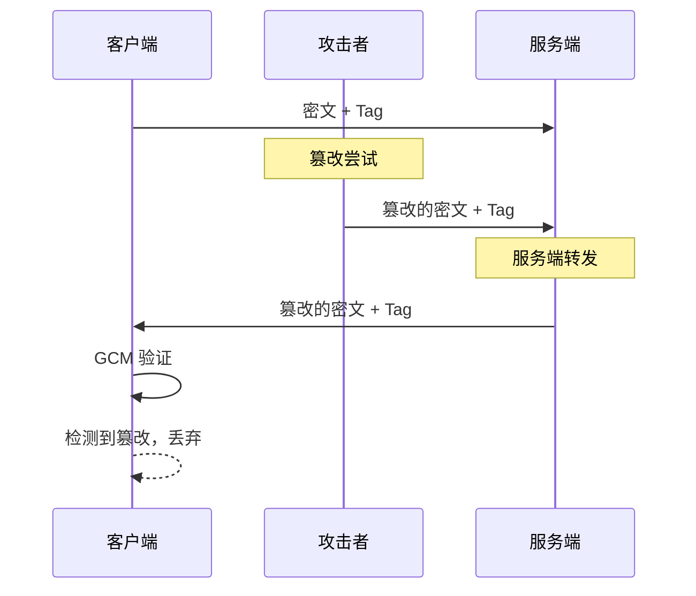
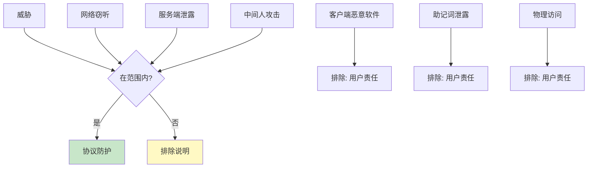

# 加密协议详解

本文档详细说明 Note Sync Now 的端到端加密协议设计与实现。

## 协议概述



## 密钥派生

### BIP39 助记词



**助记词属性**：

| 属性 | 值 | 说明 |
|------|---|------|
| 单词数 | 12 | BIP39 标准 |
| 熵值 | 128 bits | 安全强度 |
| 校验和 | 4 bits | 检测输入错误 |
| 词表 | BIP39 EN | 2048 个单词 |

### PBKDF2 密钥派生

```typescript
// 密钥派生伪代码
async function deriveKey(mnemonic: string, roomId: string): Promise<CryptoKey> {
  // 1. 助记词转种子
  const seed = bip39.mnemonicToSeedSync(mnemonic)
  
  // 2. PBKDF2 派生
  const key = await crypto.subtle.importKey(
    'raw',
    seed,
    'PBKDF2',
    false,
    ['deriveBits', 'deriveKey']
  )
  
  const derivedKey = await crypto.subtle.deriveKey(
    {
      name: 'PBKDF2',
      salt: new TextEncoder().encode(roomId),
      iterations: 100000,
      hash: 'SHA-256'
    },
    key,
    { name: 'AES-GCM', length: 256 },
    false,
    ['encrypt', 'decrypt']
  )
  
  return derivedKey
}
```

**派生参数**：

| 参数 | 值 | 安全考量 |
|------|---|---------|
| 迭代次数 | 100,000 | 抗 GPU 暴力破解 |
| 哈希函数 | SHA-256 | 标准安全哈希 |
| Salt | roomId | 房间隔离 |
| 输出长度 | 256 bits | AES-256 密钥 |

### 房间 ID 生成



## 加密算法

### AES-256-GCM



**算法参数**：

| 参数 | 值 | 说明 |
|------|---|------|
| 算法 | AES-256-GCM | 认证加密 |
| 密钥长度 | 256 bits | 高安全强度 |
| IV 长度 | 96 bits | 标准推荐 |
| Tag 长度 | 128 bits | 完整性保护 |
| AAD | roomId | 绑定房间 |

### 加密实现

```typescript
// 加密伪代码
async function encrypt(content: string, key: CryptoKey, roomId: string): Promise<EncryptedData> {
  // 1. 生成随机 IV
  const iv = crypto.getRandomValues(new Uint8Array(12))
  
  // 2. 编码明文
  const encoded = new TextEncoder().encode(content)
  
  // 3. AES-GCM 加密
  const ciphertext = await crypto.subtle.encrypt(
    {
      name: 'AES-GCM',
      iv: iv,
      additionalData: new TextEncoder().encode(roomId)
    },
    key,
    encoded
  )
  
  // 4. 返回结构化数据
  return {
    iv: base64Encode(iv),
    data: base64Encode(ciphertext.slice(0, -16)),  // 密文
    tag: base64Encode(ciphertext.slice(-16)),      // 认证标签
    roomId: roomId
  }
}
```

### 解密实现

```typescript
// 解密伪代码
async function decrypt(encrypted: EncryptedData, key: CryptoKey): Promise<string> {
  // 1. 解码 Base64
  const iv = base64Decode(encrypted.iv)
  const ciphertext = concat(
    base64Decode(encrypted.data),
    base64Decode(encrypted.tag)
  )
  
  // 2. AES-GCM 解密
  const plaintext = await crypto.subtle.decrypt(
    {
      name: 'AES-GCM',
      iv: iv,
      additionalData: new TextEncoder().encode(encrypted.roomId)
    },
    key,
    ciphertext
  )
  
  // 3. 解码明文
  return new TextDecoder().decode(plaintext)
}
```

## 安全属性

### 机密性



**保证**：没有密钥的攻击者无法从密文恢复明文。

### 完整性



**保证**：任何对密文的篡改都会被检测到，解密将失败。

### 认证性

通过 AAD (Additional Authenticated Data) 绑定房间 ID：

```typescript
// 加密时绑定房间
additionalData: new TextEncoder().encode(roomId)

// 解密时验证房间
// 如果 roomId 不匹配，解密失败
```

**保证**：密文不能跨房间使用。

## 安全假设

### 密码学假设

| 假设 | 说明 | 依赖 |
|------|------|------|
| AES-GCM 安全 | AES-GCM 是 IND-CCA2 安全的 | 标准假设 |
| PBKDF2 安全 | 高迭代使暴力破解不可行 | 计算复杂度 |
| 随机数安全 | IV 生成器是密码学安全的 | Web Crypto API |

### 实现假设

| 假设 | 说明 | 风险 |
|------|------|------|
| Web Crypto API 正确 | 浏览器实现无漏洞 | 低 |
| 助记词保密 | 用户不泄露助记词 | 用户责任 |
| 客户端安全 | 客户端代码未被篡改 | 用户责任 |

### 威胁排除



## 协议限制

### 已知限制

| 限制 | 说明 | 缓解措施 |
|------|------|---------|
| 无前向保密 | 密钥不变 | 用户可重新生成助记词 |
| 无完美前向保密 | 依赖计算复杂度 | 高迭代次数 |
| 单密钥 | 每房间一个密钥 | 房间隔离 |

### 不防护的威胁

::: warning 用户责任
以下威胁需要用户自行防护：

1. **助记词泄露**：不要在不安全环境分享助记词
2. **客户端恶意软件**：使用可信的客户端
3. **物理访问**：保护设备物理安全
:::

## 实现参考

### 关键文件

| 文件 | 功能 |
|------|------|
| `apps/web/src/utils/crypto/index.js` | 加密模块入口 |
| `apps/web/src/utils/crypto/encrypt.js` | 加密实现 |
| `apps/web/src/utils/crypto/decrypt.js` | 解密实现 |
| `apps/web/src/utils/crypto/keyDerivation.js` | 密钥派生 |

### 依赖库

| 库 | 用途 | 版本 |
|---|------|------|
| bip39 | 助记词处理 | latest |
| Web Crypto API | 加密原语 | 浏览器内置 |

---

::: tip 安全审计
本协议设计参考了 Signal Protocol 和 Wire Protocol 的最佳实践。建议在生产部署前进行专业安全审计。
:::
