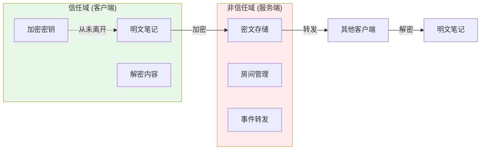
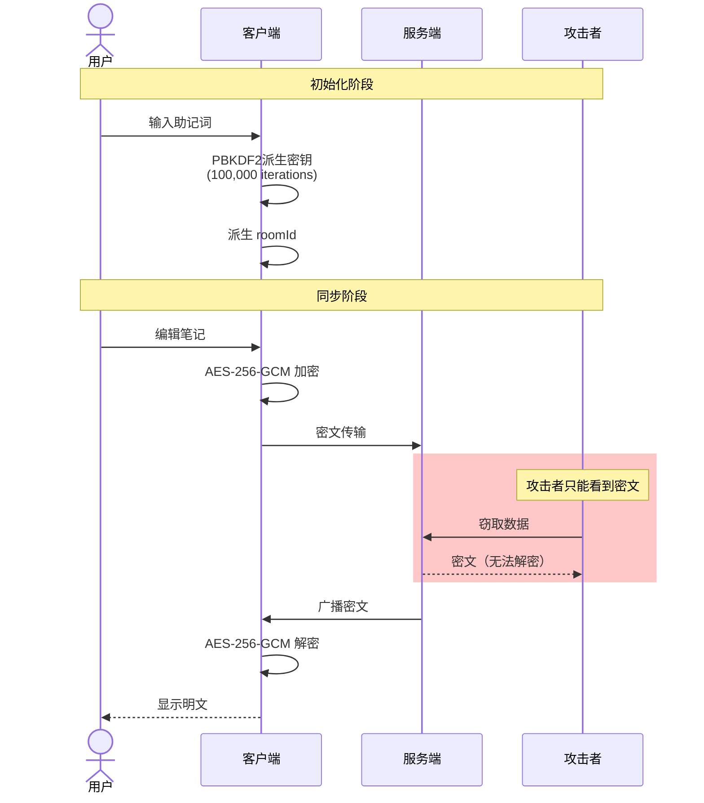
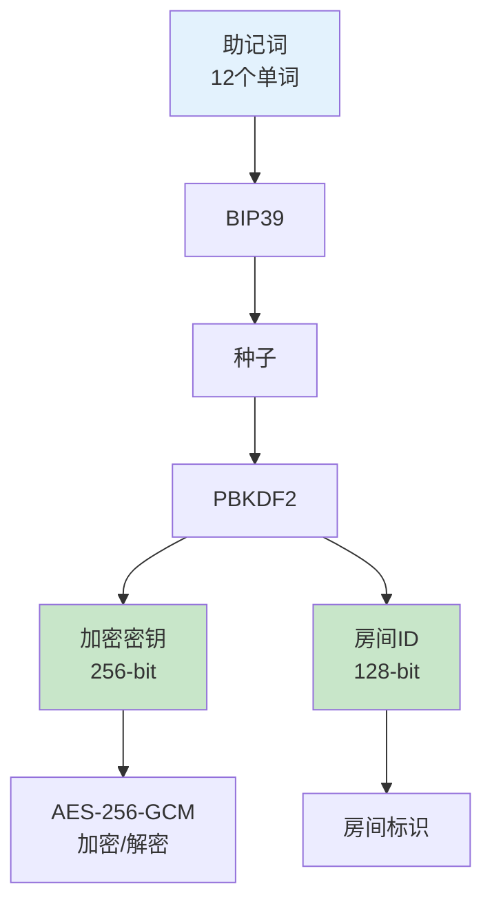
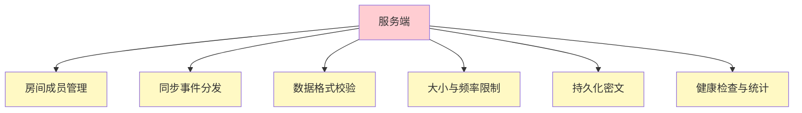
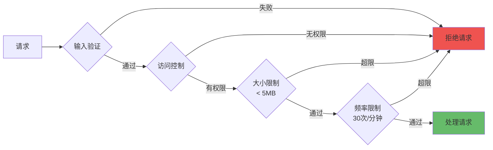
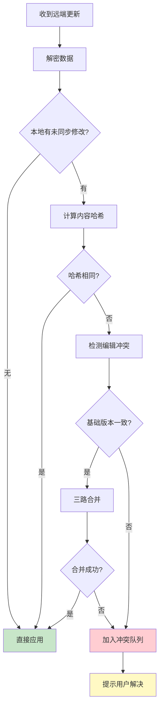
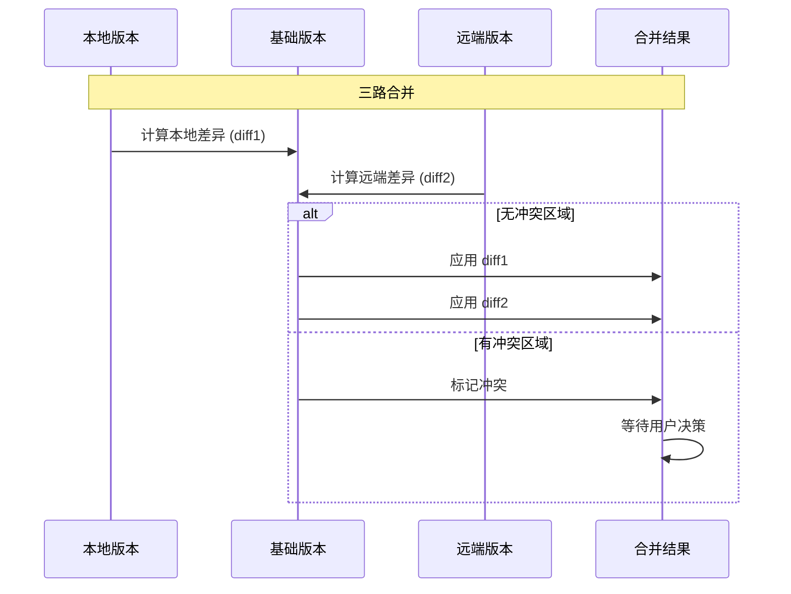
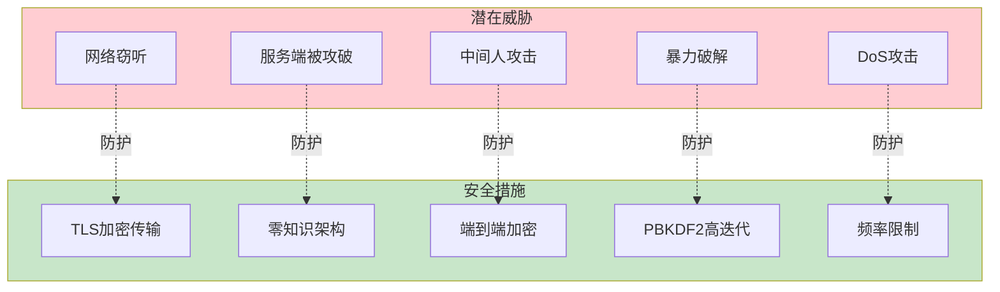

# 安全与同步机制

Note Sync Now 的核心价值不只是"实时同步"，而是"在不把明文交给服务端的前提下完成同步协作"。

## 安全边界图

## 端到端加密流程

## 客户端安全职责

### 密钥管理

### 加密模块职责

| 功能 | 实现 | 安全等级 |
|------|------|---------|
| 密钥派生 | PBKDF2 (100,000 iterations) | 抗暴力破解 |
| 加密算法 | AES-256-GCM | 军事级别 |
| 认证标签 | 128-bit GCM tag | 防篡改 |
| 助记词熵 | 128-bit (12 words) | 高熵值 |

**关键代码位置**：
- `apps/web/src/utils/crypto` - 加密模块
- `apps/web/src/hooks/useSocket.js` - 同步引擎
- `apps/web/src/store/useStore.js` - 状态管理

## 服务端安全边界

### 服务端职责

服务端**仅负责**：

### 服务端防护措施

| 防护措施 | 限制值 | 目的 |
|---------|-------|------|
| 房间ID格式 | 长度+字符限制 | 防止注入 |
| 更新大小 | < 5MB | 防止DoS |
| 更新频率 | 30次/分钟 | 防止滥用 |
| 载荷格式 | 必须有 encryptedData | 格式验证 |

**关键代码位置**：
- `apps/api/index.js` - 服务端入口
- `apps/api/src/persistence/` - 持久化层

## 冲突处理机制

### 三路合并算法

## 威胁模型

| 威胁 | 风险等级 | 防护措施 | 状态 |
|------|---------|---------|------|
| 网络窃听 | 高 | TLS + E2EE | ✅ 已防护 |
| 服务端数据泄露 | 高 | 零知识架构 | ✅ 已防护 |
| 中间人攻击 | 中 | 客户端加密 | ✅ 已防护 |
| 暴力破解密钥 | 中 | PBKDF2 (100k iter) | ✅ 已防护 |
| DoS攻击 | 中 | 频率/大小限制 | ✅ 已防护 |
| 客户端恶意代码 | 低 | 代码审计 | ⚠️ 需用户注意 |

## 运行时可观测性

服务端提供：

| 端点 | 用途 | 信息 |
|------|------|------|
| `/health` | 健康检查 | 连接数、房间数、持久化状态 |
| `/stats` | 统计信息 | 内存使用、持久化统计 |

## 推荐阅读顺序

1. [架构说明](/zh-CN/architecture)
2. 当前页面：安全与同步机制
3. [加密协议详解](/zh-CN/crypto-protocol)
4. [部署与运行](/zh-CN/deployment)
