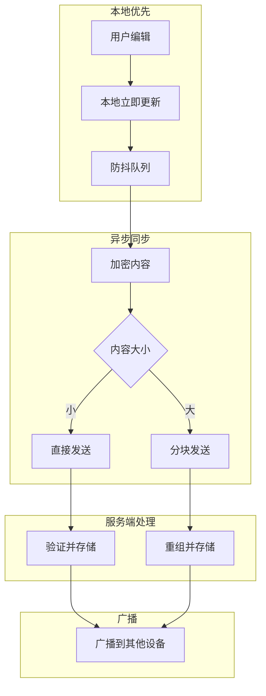
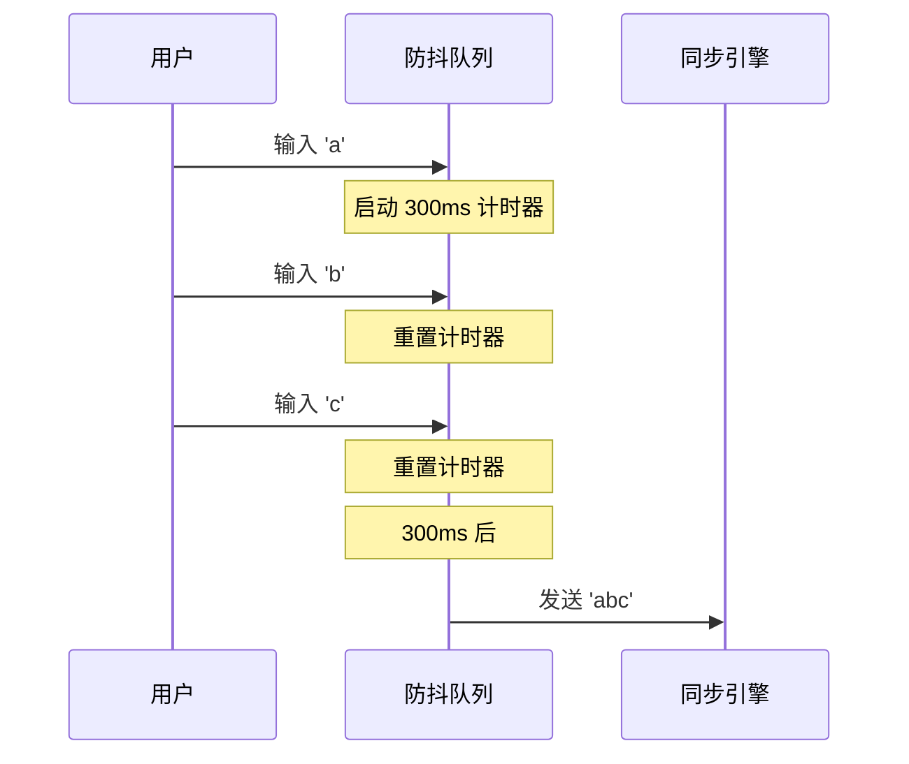
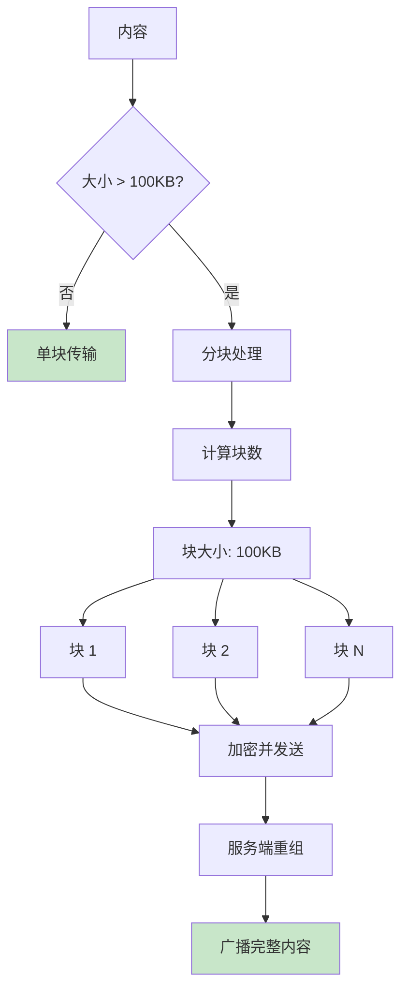
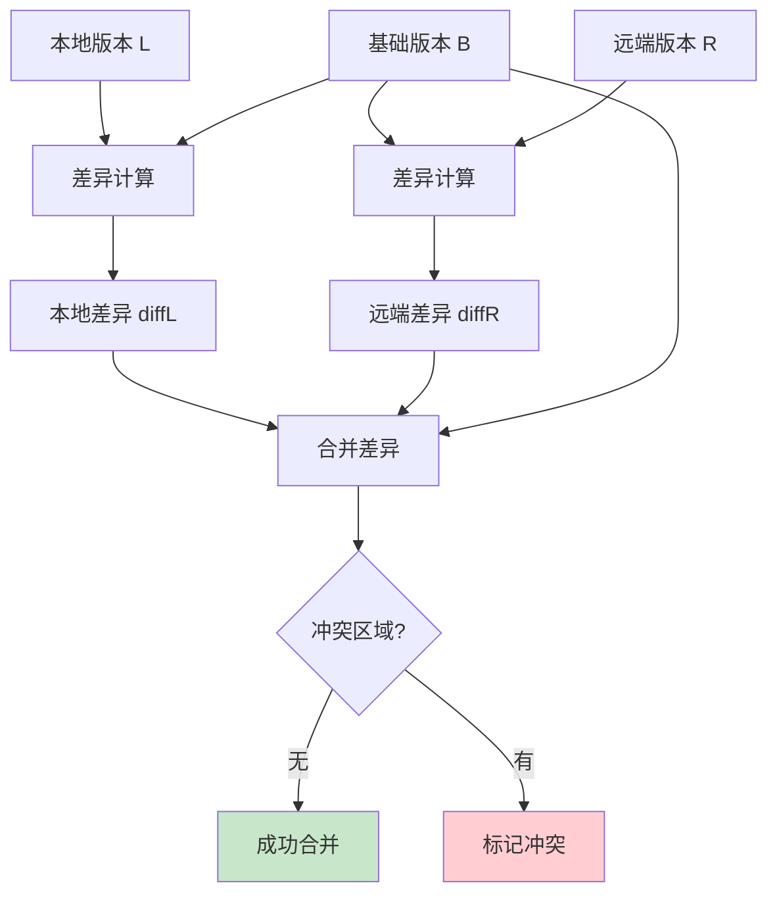
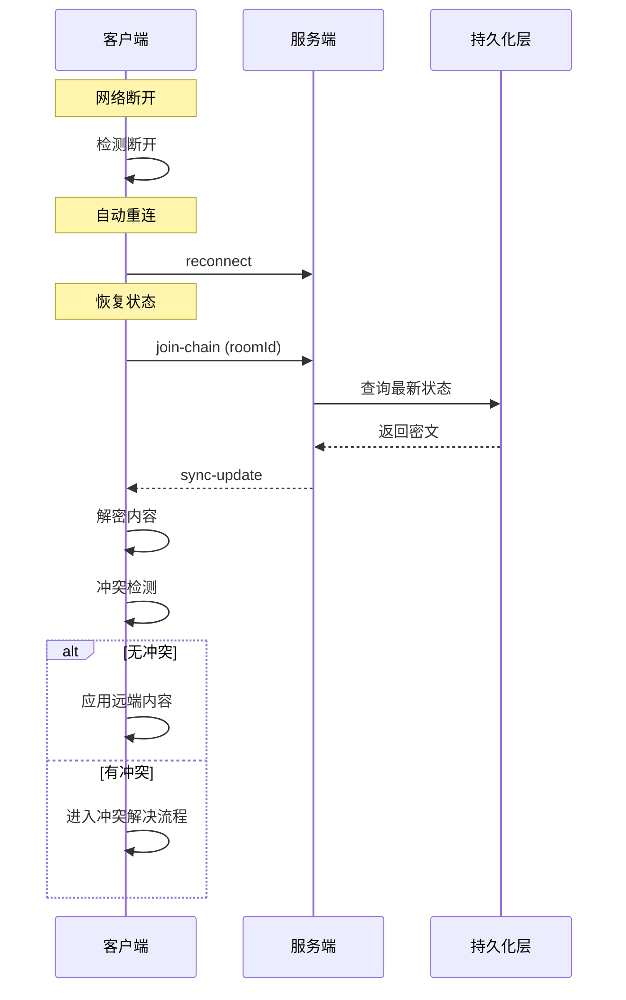
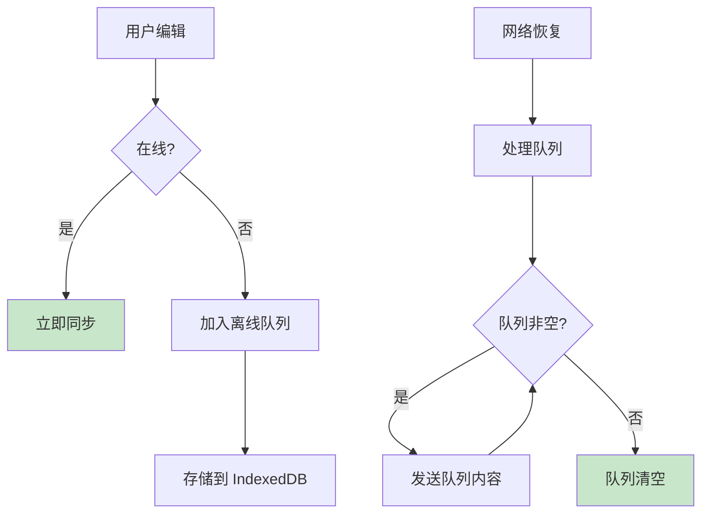
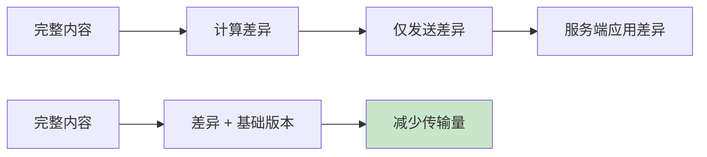

# 同步算法说明

本文档详细说明 Note Sync Now 的同步策略、分块传输与冲突解决算法。

## 同步策略概述



## 本地更新策略

### 防抖机制



**防抖参数**：

| 参数 | 值 | 说明 |
|------|---|------|
| 延迟时间 | 300ms | 平衡响应性与效率 |
| 最大等待 | 3s | 确保最终同步 |
| 即时触发 | 失焦/提交 | 用户操作完成 |

### 本地状态管理

```typescript
// 状态更新流程
interface NoteState {
  content: string           // 当前内容
  lastSyncedHash: string    // 最后同步的哈希
  isDirty: boolean          // 是否有未同步修改
  pendingUpdate: string | null  // 待发送内容
}

function onUserInput(newContent: string) {
  state.content = newContent
  state.isDirty = true
  
  // 加入防抖队列
  debounceQueue.add(() => {
    state.pendingUpdate = newContent
    syncEngine.pushUpdate(newContent)
  })
}
```

## 分块传输算法

### 分块策略



**分块参数**：

| 参数 | 值 | 说明 |
|------|---|------|
| 分块阈值 | 100 KB | 超过此大小分块 |
| 块大小 | 100 KB | 每块大小 |
| 最大总大小 | 5 MB | 单次更新上限 |
| 块超时 | 30 s | 块传输超时 |

### 分块实现

```typescript
// 分块发送伪代码
async function sendChunked(content: string, key: CryptoKey, roomId: string) {
  const CHUNK_SIZE = 100 * 1024  // 100 KB
  const encoded = new TextEncoder().encode(content)
  const totalChunks = Math.ceil(encoded.length / CHUNK_SIZE)
  
  if (totalChunks === 1) {
    // 单块直接发送
    const encrypted = await encrypt(encoded, key, roomId)
    socket.emit('push-update', { roomId, encryptedData: encrypted })
    return
  }
  
  // 分块发送
  const sessionId = generateSessionId()
  
  for (let i = 0; i < totalChunks; i++) {
    const chunk = encoded.slice(i * CHUNK_SIZE, (i + 1) * CHUNK_SIZE)
    const encrypted = await encrypt(chunk, key, roomId)
    
    socket.emit('push-update', {
      roomId,
      encryptedData: encrypted,
      chunkIndex: i,
      totalChunks,
      sessionId
    })
    
    // 等待 ack 后发送下一块
    await waitForAck()
  }
}
```

### 服务端重组

```typescript
// 服务端重组伪代码
const chunkSessions = new Map<string, ChunkSession>()

function handleChunkedUpdate(data: PushUpdate) {
  if (!data.chunkIndex) {
    // 单块直接处理
    processUpdate(data)
    return
  }
  
  // 分块重组
  const session = chunkSessions.get(data.sessionId) || createSession(data)
  session.chunks[data.chunkIndex] = data.encryptedData
  
  if (session.isComplete()) {
    const fullData = session.reassemble()
    processUpdate({ ...data, encryptedData: fullData })
    chunkSessions.delete(data.sessionId)
  }
  
  // 超时清理
  setTimeout(() => chunkSessions.delete(data.sessionId), 30000)
}
```

## 冲突检测算法

### 版本向量

```mermaid
graph LR
    subgraph 设备A
        A1[v1: "Hello"] --> A2[v2: "Hello World"]
    end
    
    subgraph 设备B
        B1[v1: "Hello"] --> B2[v2: "Hello!"]
    end
    
    A2 --> C{冲突检测}
    B2 --> C
    
    C --> D[基础版本: v1]
    C --> E[本地修改: "World"]
    C --> F[远端修改: "!"]
    
    style C fill:#fff9c4
```

### 哈希比较

```typescript
// 冲突检测伪代码
interface ConflictState {
  localHash: string      // 本地内容哈希
  baseHash: string       // 基础版本哈希
  remoteHash: string     // 远端内容哈希
}

function detectConflict(state: ConflictState): ConflictResult {
  // 无冲突：远端与本地一致
  if (state.localHash === state.remoteHash) {
    return { type: 'none' }
  }
  
  // 本地未修改：直接应用远端
  if (state.localHash === state.baseHash) {
    return { type: 'apply-remote' }
  }
  
  // 远端是旧版本：忽略
  if (state.remoteHash === state.baseHash) {
    return { type: 'ignore-remote' }
  }
  
  // 真正的冲突：需要合并
  return { type: 'conflict', needsMerge: true }
}
```

## 三路合并算法

### 算法原理



### 合并实现

```typescript
// 三路合并伪代码
function threeWayMerge(
  local: string,
  base: string,
  remote: string
): MergeResult {
  // 1. 计算差异
  const localDiff = diff(base, local)   // B → L 的差异
  const remoteDiff = diff(base, remote) // B → R 的差异
  
  // 2. 尝试合并
  const conflicts: Conflict[] = []
  const merged: string[] = []
  
  // 遍历所有区域
  for (const region of allRegions(localDiff, remoteDiff)) {
    if (region.onlyLocal) {
      // 仅本地修改：应用本地
      merged.push(region.localChange)
    } else if (region.onlyRemote) {
      // 仅远端修改：应用远端
      merged.push(region.remoteChange)
    } else if (region.localChange === region.remoteChange) {
      // 相同修改：任选其一
      merged.push(region.localChange)
    } else {
      // 冲突：标记并保留两者
      conflicts.push({
        position: region.position,
        local: region.localChange,
        remote: region.remoteChange,
        base: region.baseContent
      })
      merged.push(markConflict(region))
    }
  }
  
  return {
    content: merged.join(''),
    conflicts,
    hasConflicts: conflicts.length > 0
  }
}
```

### 冲突标记格式

```
<<<<<<< LOCAL
本地修改内容
=======
远端修改内容
>>>>>>> REMOTE
```

## 重连恢复机制

### 重连流程



### 离线队列



**离线队列属性**：

| 属性 | 值 | 说明 |
|------|---|------|
| 存储 | IndexedDB | 持久化 |
| 最大条目 | 100 | 防止无限增长 |
| 合并策略 | 最后一条有效 | 同一笔记只保留最新 |

## 性能优化

### 增量同步



**优化效果**：

| 场景 | 无优化 | 增量同步 |
|------|-------|---------|
| 小修改 (10B) | 发送 1MB | 发送 ~100B |
| 大文档 (1MB) | 每次发送 1MB | 仅发送差异 |

### 压缩

```typescript
// 可选的压缩层
async function compressAndEncrypt(content: string): Promise<string> {
  // 1. 压缩
  const compressed = await compress(content)  // gzip/brotli
  
  // 2. 加密
  const encrypted = await encrypt(compressed)
  
  return encrypted
}
```

---

::: tip 算法选择
当前实现使用简化的三路合并。对于更复杂的协作场景，可考虑：
- OT (Operational Transformation)
- CRDT (Conflict-free Replicated Data Types)
:::
