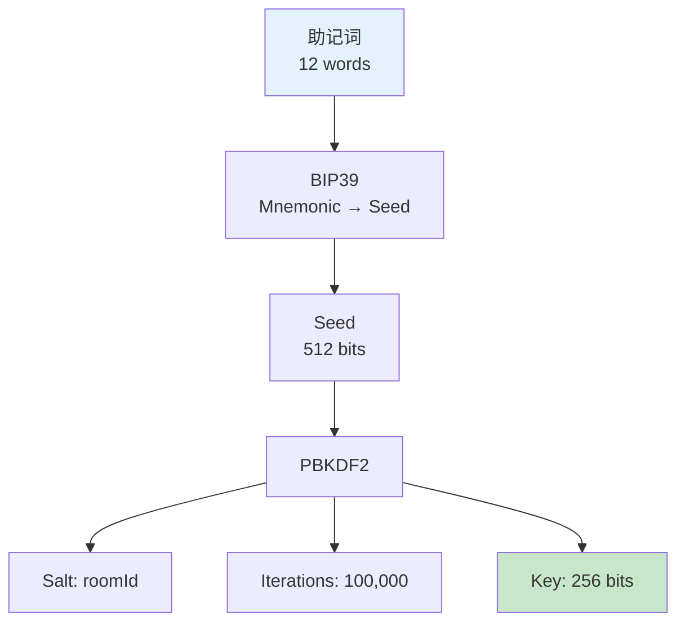
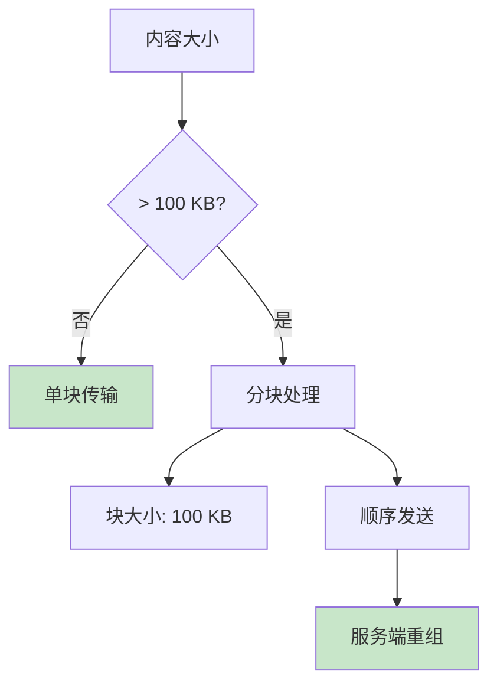
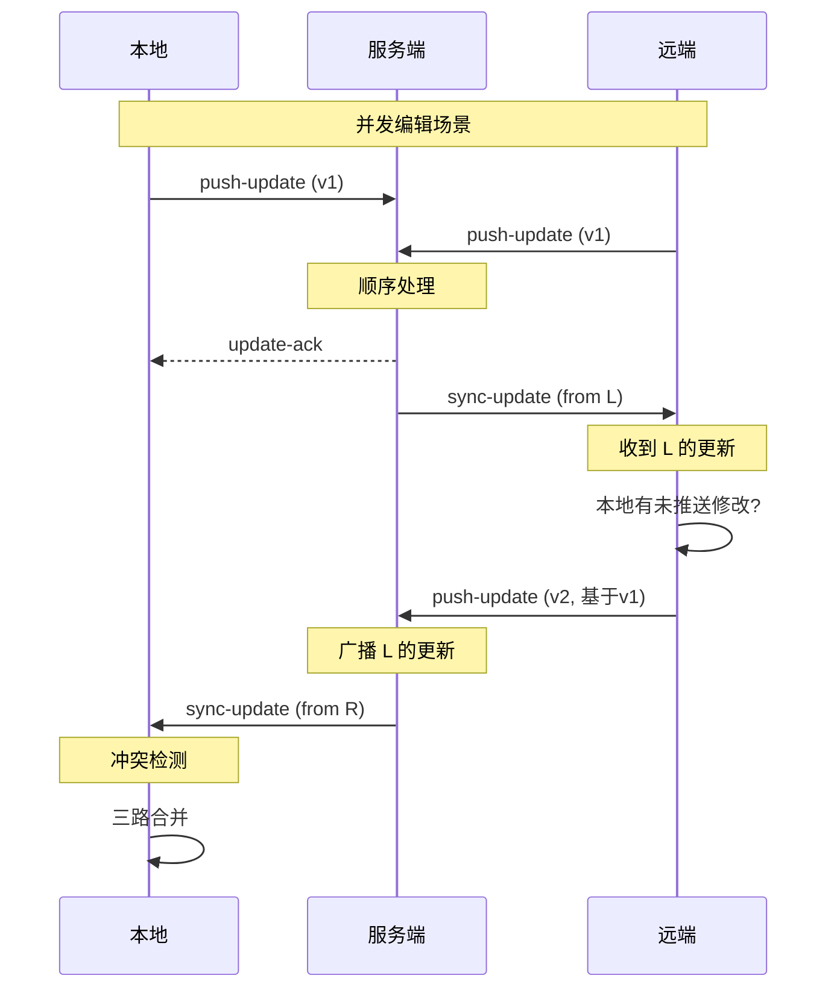
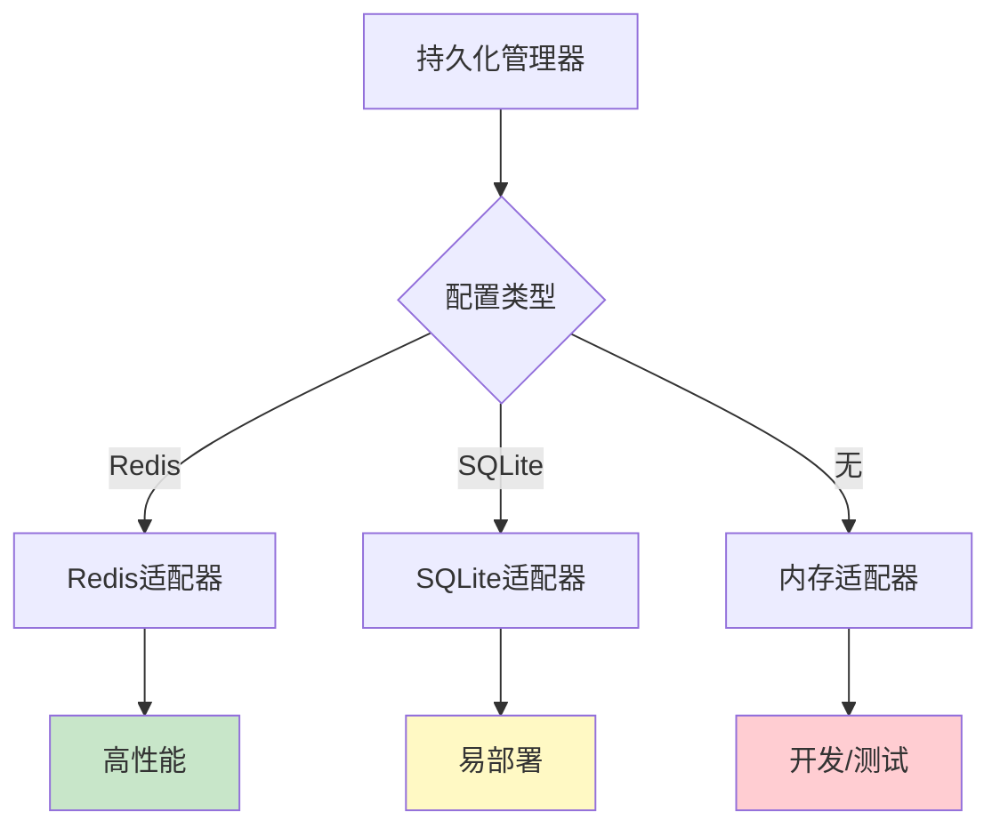
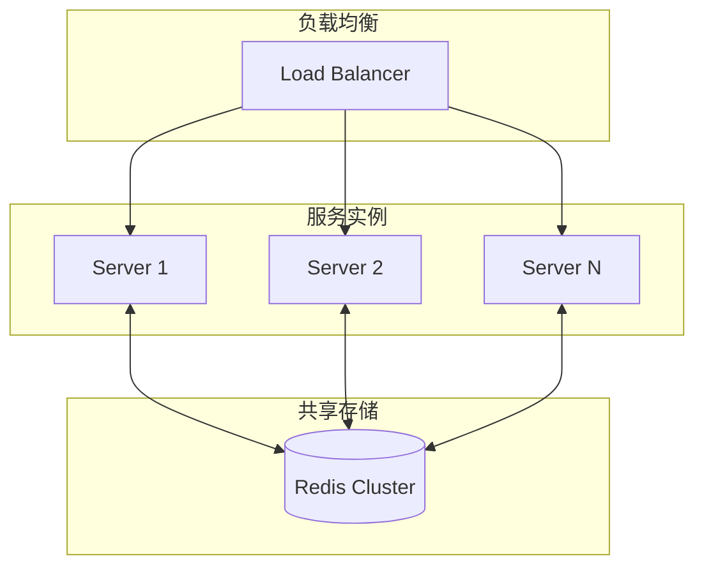

# 技术规格书

本文档定义 Note Sync Now 的技术规格、性能指标与设计约束。

## 系统需求

### 客户端

| 项目 | 最低要求 | 推荐配置 |
|------|---------|---------|
| 浏览器 | Chrome 90+, Firefox 88+, Safari 14+ | 最新稳定版 |
| 内存 | 256 MB 可用 | 512 MB+ |
| 存储 | 50 MB IndexedDB | 200 MB+ |
| 网络 | 稳定连接 | WebSocket 支持 |

### 服务端

| 项目 | 最低要求 | 推荐配置 |
|------|---------|---------|
| Node.js | 18.x | 20.x LTS |
| 内存 | 512 MB | 2 GB+ |
| 存储 | 1 GB | 10 GB+ (取决于用户量) |
| Redis | 6.x (可选) | 7.x |

## 性能规格

### 同步延迟


| 指标 | 目标值 | 测量方法 |
|------|-------|---------|
| 本地更新延迟 | < 50ms | 输入到UI更新 |
| 加密耗时 | < 100ms | 1MB内容加密 |
| 网络往返 | < 200ms | 客户端到服务端 |
| 端到端同步 | < 500ms | 输入到远端显示 |

### 吞吐量

| 场景 | 指标 |
|------|------|
| 单房间并发 | 支持 100+ 设备 |
| 单服务端连接 | 支持 10,000+ WebSocket |
| 更新吞吐 | 1,000 updates/sec |
| 最大内容大小 | 5 MB / 更新 |

## 加密规格

### 密钥派生



| 参数 | 值 | 说明 |
|------|---|------|
| 助记词长度 | 12 words | 128-bit 熵 |
| PBKDF2 迭代次数 | 100,000 | 抗暴力破解 |
| 派生密钥长度 | 256 bits | AES-256 |
| Salt | roomId | 房间隔离 |

### 加密参数

| 参数 | 值 | 说明 |
|------|---|------|
| 算法 | AES-256-GCM | 认证加密 |
| IV 长度 | 96 bits | 标准长度 |
| Tag 长度 | 128 bits | 完整性保护 |
| 关联数据 | roomId | 额外绑定 |

## 同步规格

### 消息格式

```typescript
// WebSocket 消息类型
interface JoinChain {
  event: 'join-chain'
  roomId: string      // 32字符十六进制
  deviceName: string  // 1-50字符
}

interface PushUpdate {
  event: 'push-update'
  roomId: string
  encryptedData: string  // Base64编码密文
  chunkIndex?: number    // 分块索引（可选）
  totalChunks?: number   // 总块数（可选）
}

interface SyncUpdate {
  event: 'sync-update'
  encryptedData: string
  fromDevice: string
  timestamp: number
}

interface UpdateAck {
  event: 'update-ack'
  success: boolean
  timestamp: number
}
```

### 分块策略



| 参数 | 值 |
|------|---|
| 分块阈值 | 100 KB |
| 块大小 | 100 KB |
| 最大总大小 | 5 MB |
| 块超时 | 30 秒 |

### 冲突检测



## 存储规格

### 客户端存储

| 存储 | 用途 | 大小限制 |
|------|------|---------|
| IndexedDB | 笔记内容、历史 | 浏览器配额 |
| LocalStorage | 设置、密钥缓存 | ~5 MB |
| SessionStorage | 临时状态 | ~5 MB |

### 服务端存储



| 存储后端 | 适用场景 | 持久化 |
|---------|---------|--------|
| Redis | 生产环境、高并发 | ✅ |
| SQLite | 小规模部署 | ✅ |
| 内存 | 开发测试 | ❌ |

## 服务端防护规格

### 输入验证

```typescript
// 验证规则
const validators = {
  roomId: /^[a-f0-9]{32}$/,           // 32字符十六进制
  deviceName: /^.{1,50}$/,            // 1-50字符
  encryptedData: /^.{1,7000000}$/,    // Base64, < 5MB原始
}
```

### 速率限制

| 限制类型 | 阈值 | 窗口 |
|---------|------|------|
| 更新频率 | 30 次 | 1 分钟 |
| 连接频率 | 10 次 | 1 分钟 |
| 房间创建 | 5 次 | 1 小时 |

### 资源限制

| 资源 | 限制 | 超限处理 |
|------|------|---------|
| 房间数 | 10,000 | LRU 淘汰 |
| 单房间设备数 | 100 | 拒绝加入 |
| 房间空闲 TTL | 24 小时 | 自动清理 |

## 扩展性规格

### 水平扩展



### 扩展点

| 扩展点 | 当前状态 | 扩展方式 |
|--------|---------|---------|
| 多笔记 | 架构预留 | 状态管理扩展 |
| 版本历史 | 持久化支持 | 增加版本字段 |
| 协作权限 | 未实现 | 权限模型设计 |
| 端到端测试 | 部分 | 测试覆盖提升 |

## 兼容性规格

### 浏览器兼容性

| 特性 | Chrome | Firefox | Safari | Edge |
|------|--------|---------|--------|------|
| WebSocket | ✅ 90+ | ✅ 88+ | ✅ 14+ | ✅ 90+ |
| IndexedDB | ✅ 90+ | ✅ 88+ | ✅ 14+ | ✅ 90+ |
| Web Crypto | ✅ 90+ | ✅ 88+ | ✅ 14+ | ✅ 90+ |
| ES Modules | ✅ 90+ | ✅ 88+ | ✅ 14+ | ✅ 90+ |

### API 稳定性

| API | 稳定性 | 变更策略 |
|-----|--------|---------|
| WebSocket 事件 | 稳定 | 语义化版本 |
| REST 端点 | 稳定 | 语义化版本 |
| 消息格式 | 稳定 | 向后兼容 |
| 配置格式 | 稳定 | 向后兼容 |

---

::: tip 版本说明
本规格书对应 v2.2.0 版本。后续版本变更将更新此文档。
:::
