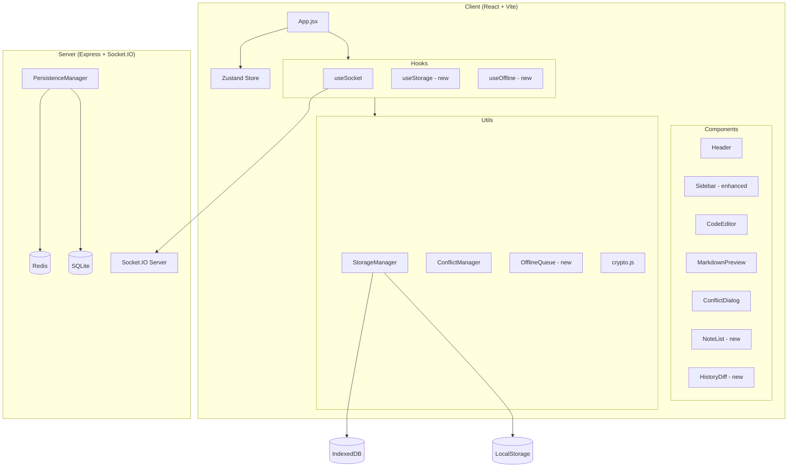
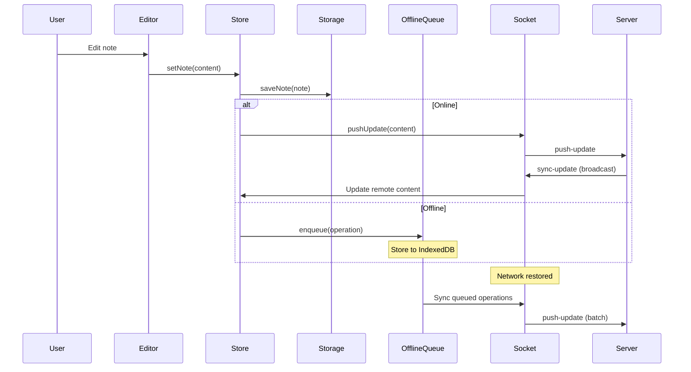

# RFC 0002: Comprehensive Refactor

> **Status:** Active
> **Created:** 2026-04-17
> **Last Updated:** 2026-04-17
> **Supersedes:** `.kiro/specs/comprehensive-refactor/design.md`

## Summary

This RFC describes a comprehensive refactor of the Note Sync Now system, focusing on integrating implemented but unused feature modules (storage system, conflict management, offline queue) and adding multi-note support with enhanced history versioning.

## Motivation

After code analysis, several functional modules were found to be implemented but not integrated into the main application:

- **StorageManager**: Client-side storage with IndexedDB/LocalStorage support
- **ConflictManager**: Conflict detection and resolution
- **OfflineQueue**: Offline operation queue management

This refactor aims to integrate these modules and add missing features to achieve production readiness.

## Architecture

### System Architecture



### Data Flow Architecture



## Components and Interfaces

### 1. Storage System Integration

#### useStorage Hook (New)

```javascript
// apps/web/src/hooks/useStorage.js

/**
 * Storage Management Hook
 * Provides unified storage interface with automatic IndexedDB/LocalStorage switching
 */
export const useStorage = () => {
  const [isInitialized, setIsInitialized] = useState(false);
  const [storageType, setStorageType] = useState(null);
  const [error, setError] = useState(null);
  const storageRef = useRef(null);

  // Initialize storage
  const initialize = async () => { /* ... */ };
  
  // Save note
  const saveNote = async (notebookId, note) => { /* ... */ };
  
  // Get note
  const getNote = async (notebookId, noteId) => { /* ... */ };
  
  // Get all notes
  const getAllNotes = async (notebookId) => { /* ... */ };
  
  // Delete note
  const deleteNote = async (notebookId, noteId) => { /* ... */ };
  
  // Save history
  const saveHistory = async (notebookId, noteId, entry) => { /* ... */ };
  
  // Get history
  const getHistory = async (notebookId, noteId) => { /* ... */ };
  
  // Cleanup storage
  const cleanup = async () => { /* ... */ };

  return {
    isInitialized,
    storageType,
    error,
    initialize,
    saveNote,
    getNote,
    getAllNotes,
    deleteNote,
    saveHistory,
    getHistory,
    cleanup,
  };
};
```

### 2. Offline Queue System

#### OfflineQueue Class (New)

```javascript
// apps/web/src/utils/offline/OfflineQueue.js

/**
 * Offline Operation Queue
 * Manages offline edit operations, auto-sync on network restore
 */
class OfflineQueue {
  constructor(storage) {
    this.storage = storage;
    this.queue = [];
    this.isProcessing = false;
  }

  // Add operation to queue
  async enqueue(operation) { /* ... */ }
  
  // Process queue
  async processQueue(socket) { /* ... */ }
  
  // Get queue size
  getQueueSize() { /* ... */ }
  
  // Clear queue
  async clearQueue() { /* ... */ }
  
  // Get queue status
  getStatus() { /* ... */ }
}
```

#### useOffline Hook (New)

```javascript
// apps/web/src/hooks/useOffline.js

/**
 * Offline Status Management Hook
 * Monitors network status, manages offline queue
 */
export const useOffline = () => {
  const [isOnline, setIsOnline] = useState(navigator.onLine);
  const [queueSize, setQueueSize] = useState(0);
  const queueRef = useRef(null);

  // Add operation to offline queue
  const enqueueOperation = async (operation) => { /* ... */ };
  
  // Process offline queue
  const processQueue = async (socket) => { /* ... */ };
  
  // Get offline status
  const getOfflineStatus = () => { /* ... */ };

  return {
    isOnline,
    queueSize,
    enqueueOperation,
    processQueue,
    getOfflineStatus,
  };
};
```

### 3. Multi-Note Support

#### Note Data Model

```javascript
/**
 * Note Data Structure
 */
interface Note {
  id: string;           // Unique identifier
  title: string;        // Note title
  content: string;      // Note content
  createdAt: number;    // Creation timestamp
  updatedAt: number;    // Update timestamp
  version: number;      // Version number
  tags: string[];       // Tag list
  deviceId: string;     // Last edit device
}
```

#### NoteList Component (New)

```javascript
// apps/web/src/components/NoteList/NoteList.jsx

/**
 * Note List Component
 * Displays and manages multiple notes
 */
const NoteList = ({
  notes,
  activeNoteId,
  onSelectNote,
  onCreateNote,
  onDeleteNote,
  onRenameNote,
  searchQuery,
  darkMode,
}) => {
  // Filter and sort notes
  const filteredNotes = useMemo(() => {
    return notes
      .filter(note => 
        note.title.toLowerCase().includes(searchQuery.toLowerCase()) ||
        note.content.toLowerCase().includes(searchQuery.toLowerCase())
      )
      .sort((a, b) => b.updatedAt - a.updatedAt);
  }, [notes, searchQuery]);

  return (
    <div className="note-list">
      {/* Search box */}
      {/* Create button */}
      {/* Note list */}
    </div>
  );
};
```

### 4. History Version Enhancement

#### HistoryDiff Component (New)

```javascript
// apps/web/src/components/History/HistoryDiff.jsx

/**
 * History Version Diff Component
 * Displays differences between two versions
 */
const HistoryDiff = ({
  oldVersion,
  newVersion,
  onRestore,
  onClose,
  darkMode,
}) => {
  // Calculate diff
  const diff = useMemo(() => {
    return computeDiff(oldVersion.content, newVersion.content);
  }, [oldVersion, newVersion]);

  return (
    <div className="history-diff">
      {/* Version info */}
      {/* Diff view */}
      {/* Action buttons */}
    </div>
  );
};
```

### 5. Store Enhancement

```javascript
// apps/web/src/store/useStore.js (enhanced)

export const useAppStore = create(
  persist(
    (set, get) => ({
      // Existing state...
      
      // Multi-note state (new)
      notes: [],                    // Note list
      activeNoteId: null,           // Current active note ID
      
      // Offline state (new)
      isOnline: true,               // Network status
      offlineQueueSize: 0,          // Offline queue size
      
      // Storage state (new)
      storageInitialized: false,    // Storage initialized
      storageType: null,            // Current storage type
      
      // Multi-note operations (new)
      setNotes: (notes) => set({ notes }),
      addNote: (note) => set((state) => ({ 
        notes: [...state.notes, note] 
      })),
      updateNote: (noteId, updates) => set((state) => ({
        notes: state.notes.map(n => 
          n.id === noteId ? { ...n, ...updates } : n
        )
      })),
      removeNote: (noteId) => set((state) => ({
        notes: state.notes.filter(n => n.id !== noteId)
      })),
      setActiveNoteId: (noteId) => set({ activeNoteId: noteId }),
      
      // Offline operations (new)
      setIsOnline: (isOnline) => set({ isOnline }),
      setOfflineQueueSize: (size) => set({ offlineQueueSize: size }),
      
      // Storage operations (new)
      setStorageInitialized: (initialized) => set({ storageInitialized: initialized }),
      setStorageType: (type) => set({ storageType: type }),
    }),
    {
      name: 'note-sync-storage',
      partialize: (state) => ({
        // Existing persistence fields...
        notes: state.notes,
        activeNoteId: state.activeNoteId,
      }),
    }
  )
);
```

## Data Models

### Storage Schema

```javascript
// IndexedDB Schema
const DB_SCHEMA = {
  name: 'NoteSyncDB',
  version: 2,
  stores: {
    notes: {
      keyPath: 'id',
      indexes: [
        { name: 'notebookId', keyPath: 'notebookId' },
        { name: 'updatedAt', keyPath: 'updatedAt' },
        { name: 'title', keyPath: 'title' },
      ]
    },
    history: {
      keyPath: 'id',
      indexes: [
        { name: 'noteId', keyPath: 'noteId' },
        { name: 'timestamp', keyPath: 'timestamp' },
      ]
    },
    pendingOps: {
      keyPath: 'id',
      indexes: [
        { name: 'timestamp', keyPath: 'timestamp' },
        { name: 'type', keyPath: 'type' },
      ]
    },
    settings: {
      keyPath: 'key',
    }
  }
};
```

### Offline Operation Data Structure

```javascript
/**
 * Offline Operation Data Structure
 */
interface PendingOperation {
  id: string;           // Operation ID
  type: 'create' | 'update' | 'delete';  // Operation type
  noteId: string;       // Note ID
  data: any;            // Operation data
  timestamp: number;    // Operation timestamp
  retryCount: number;   // Retry count
}
```

## Correctness Properties

*Correctness properties are characteristics or behaviors that should hold true across all valid executions of a system. Properties serve as the bridge between human-readable specifications and machine-verifiable correctness guarantees.*

### Property 1: Storage Round-Trip Consistency

*For any* valid note object, saving it to storage and then retrieving it should produce an equivalent object with the same content, title, and metadata.

**Validates:** Requirements 1.3, 1.4

### Property 2: Storage Fallback Data Preservation

*For any* data stored in IndexedDB, when IndexedDB becomes unavailable and the system falls back to LocalStorage, the data should remain accessible and unchanged.

**Validates:** Requirements 1.2

### Property 3: Conflict Detection Completeness

*For any* two edits to the same note with timestamps within 5 seconds of each other, the ConflictManager should detect a conflict and preserve both versions.

**Validates:** Requirements 2.1

### Property 4: Three-Way Merge Correctness

*For any* base version and two divergent edits, the three-way merge should produce a result that contains all non-conflicting changes from both versions.

**Validates:** Requirements 2.4

### Property 5: Offline Queue Order Preservation

*For any* sequence of offline operations, when processed after reconnection, the operations should be applied in the same order they were enqueued.

**Validates:** Requirements 3.2, 3.3

### Property 6: Note Unique Identifier

*For any* number of notes created, each note should have a unique identifier that does not collide with any other note's identifier.

**Validates:** Requirements 4.1

### Property 7: Note Switch Data Preservation

*For any* note switch operation, the previously active note's content should be saved before loading the new note, and switching back should restore the exact content.

**Validates:** Requirements 4.2

### Property 8: Note Sorting Correctness

*For any* list of notes, the displayed order should always be sorted by updatedAt timestamp in descending order (most recent first).

**Validates:** Requirements 4.5

### Property 9: History Version Limit

*For any* note with history entries, when the history count exceeds 50, the oldest entries should be automatically removed to maintain exactly 50 entries.

**Validates:** Requirements 5.5

### Property 10: Version Restore Completeness

*For any* history entry restoration, the current note content should be updated to match the restored version exactly, and a new history entry should be created.

**Validates:** Requirements 5.4

### Property 11: Version Increment Correctness

*For any* note save operation, the version number should be incremented by exactly 1 from the previous version.

**Validates:** Requirements 7.2

### Property 12: Data Validation Rejects Invalid Input

*For any* note object missing required fields (id, content), the storage system should reject the save operation and throw an appropriate error.

**Validates:** Requirements 7.4

## Error Handling

### Storage Errors

| Error Type | Handling |
|------------|----------|
| IndexedDB unavailable | Auto fallback to LocalStorage, show notification |
| Storage quota exceeded | Show warning, provide cleanup options |
| Data corruption | Attempt recovery from backup, show error message |
| Write failure | Retry 3 times, show error after failure |

### Network Errors

| Error Type | Handling |
|------------|----------|
| Connection lost | Switch to offline mode, show offline indicator |
| Sync failure | Add operation to offline queue, retry later |
| Reconnection failure | Show reconnect status, max 10 retries |
| Server error | Show error message, preserve local data |

### Conflict Errors

| Error Type | Handling |
|------------|----------|
| Conflict detected | Show conflict dialog, wait for user resolution |
| Merge failure | Preserve both versions, let user choose manually |
| Resolution failure | Show error, allow retry |

## Implementation Phases

### Phase 1: Fix Existing Tests and Infrastructure

- [x] 1.1 Fix LocalStorageAdapter test failures
- [x] 1.2 Write property tests for version increment
- [x] 1.3 Fix history cleanup return value
- [x] 1.4 Fix data validation logic
- [x] 1.5 Write property tests for data validation
- [x] 1.6 Checkpoint - All existing tests pass

### Phase 2: Storage System Integration

- [x] 2.1 Create useStorage Hook
- [x] 2.2 Write property tests for storage round-trip
- [x] 2.3 Implement note CRUD operations
- [x] 2.4 Implement history operations
- [x] 2.5 Write property tests for history version limit
- [x] 2.6 Integrate storage to Zustand Store
- [x] 2.7 Initialize storage in App.jsx
- [x] 2.8 Implement auto-save feature
- [ ] 2.9 Implement data recovery feature
- [ ] 2.10 Checkpoint - Storage integration validation

### Phase 3: Offline Mode Support

- [x] 3.1 Create OfflineQueue class
- [ ] 3.2 Write property tests for offline queue order
- [x] 3.3 Create useOffline Hook
- [ ] 3.4 Integrate offline queue to useSocket
- [ ] 3.5 Add offline status indicator
- [ ] 3.6 Handle offline conflicts
- [ ] 3.7 Checkpoint - Offline mode validation

### Phase 4: Multi-Note Support

- [ ] 4.1 Update Zustand Store for multi-note
- [ ] 4.2 Write property tests for note unique identifier
- [ ] 4.3 Implement note switch logic
- [ ] 4.4 Write property tests for note switch data preservation
- [ ] 4.5 Create NoteList component
- [ ] 4.6 Write property tests for note sorting
- [ ] 4.7 Implement note search
- [ ] 4.8 Implement note rename
- [ ] 4.9 Integrate NoteList to Sidebar
- [ ] 4.10 Update useSocket for multi-note sync
- [ ] 4.11 Checkpoint - Multi-note support validation

### Phase 5: History Version Enhancement and UI Improvements

- [ ] 5.1 Create HistoryDiff component
- [ ] 5.2 Enhance history panel
- [ ] 5.3 Implement version restore
- [ ] 5.4 Write property tests for version restore
- [ ] 5.5 Enhance connection status display
- [ ] 5.6 Improve error handling UI
- [ ] 5.7 Enhance member list display
- [ ] 5.8 Fix sidebar state persistence
- [ ] 5.9 Final checkpoint - Project completion validation

## Test Strategy

### Unit Tests

Unit tests verify specific examples and boundary cases:

1. **Storage System Tests**
   - IndexedDB initialization
   - LocalStorage fallback
   - Data CRUD operations
   - Storage quota handling

2. **Conflict Management Tests**
   - Conflict detection logic
   - Various resolution strategies
   - Three-way merge algorithm

3. **Offline Queue Tests**
   - Operation enqueue
   - Queue processing
   - Reconnection sync

4. **Multi-Note Tests**
   - Note creation
   - Note switching
   - Note deletion
   - Search filtering

### Property Tests

Property tests verify general properties across all inputs. Each property test should run at least 100 iterations using **fast-check** library.

Each test must be labeled with:
**Feature: comprehensive-refactor, Property {number}: {property_text}**

---

## Related Documents

- [Product Requirements](../product/note-sync-system.md)
- [Core Architecture](./0001-core-architecture.md)
- [API Specification](../api/websocket-api.yaml)
- [Database Schema](../db/schema-v1.dbml)
- [Testing Strategy](../testing/test-strategy.md)
